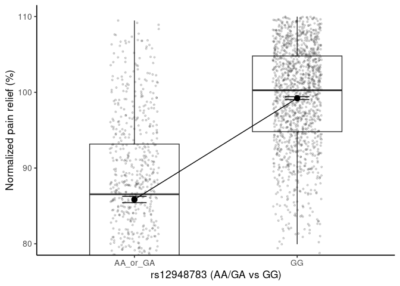

Group 6 Help (simulated data)
================
Norah Saarman
2025-11-06

- [ABSTRACT](#abstract)
- [BACKGROUND](#background)
- [STUDY QUESTION and HYPOTHESIS](#study-question-and-hypothesis)
  - [Question(s)](#questions)
  - [Hypothesis](#hypothesis)
  - [Prediction(s)](#predictions)
- [METHODS AND RESULTS](#methods-and-results)
  - [Analysis 1: Visualize with a
    Boxplot](#analysis-1-visualize-with-a-boxplot)
  - [Analysis 2:](#analysis-2)
- [DISCUSSION](#discussion)
  - [Analysis 1: Boxplot and ANOVA](#analysis-1-boxplot-and-anova)
  - [Analysis 2:](#analysis-2-1)
- [CONCLUSION](#conclusion)
- [REFERENCES](#references)

# ABSTRACT

# BACKGROUND

``` r
#background
```

# STUDY QUESTION and HYPOTHESIS

## Question(s)

## Hypothesis

## Prediction(s)

# METHODS AND RESULTS

Data simulated and given to us by instructor, based on
<https://doi.org/10.1158/1078-0432.CCR-10-3028>… The original paper
\[did what?\]…

## Analysis 1: Visualize with a Boxplot

First, we visualized the impact of RHBDF2 genotype on normalized pain
relief…

``` r
library(ggplot2)
library(dplyr)
```

    ## 
    ## Attaching package: 'dplyr'

    ## The following objects are masked from 'package:stats':
    ## 
    ##     filter, lag

    ## The following objects are masked from 'package:base':
    ## 
    ##     intersect, setdiff, setequal, union

``` r
# Read in simulated data
dat <- read.csv("epos_style_rs12948783_simulated_large.csv")

dat$carrier <- factor(dat$carrier, levels = c("AA_or_GA","GG"))

means <- dat %>%
  group_by(carrier) %>%
  summarise(m = mean(norm_pain_relief), .groups = "drop")

p2 <- ggplot(dat, aes(carrier, norm_pain_relief)) +
  geom_boxplot(width = 0.55, outlier.shape = NA) +
  geom_jitter(width = 0.15, alpha = 0.15, size = 0.8) +
  stat_summary(fun = mean, geom = "point", size = 3) +
  stat_summary(fun.data = mean_se, geom = "errorbar", width = 0.15) +
  geom_segment(data = data.frame(x = 1, xend = 2,
                                 y = means$m[means$carrier=="AA_or_GA"],
                                 yend = means$m[means$carrier=="GG"]),
               aes(x = x, xend = xend, y = y, yend = yend)) +
  coord_cartesian(ylim = c(80, 110)) +
  labs(x = "rs12948783 (AA/GA vs GG)",
       y = "Normalized pain relief (%)") +
  theme_classic(base_size = 13)

p2
```

<!-- -->

``` r
# ggsave("boxplot_collapsed.png", p2, width = 5, height = 4, dpi = 300)
```

Next, we performed an ANOVA to test if pain relief was statistically
different between the different RHBDF2 genotypes.

``` r
# One-way ANOVA (3 genotypes):
dat$genotype <- factor(dat$genotype, levels = c("AA","GA","GG"))
summary(aov(norm_pain_relief ~ genotype, data = dat))
```

    ##               Df Sum Sq Mean Sq F value Pr(>F)    
    ## genotype       2  84636   42318   602.4 <2e-16 ***
    ## Residuals   1979 139026      70                   
    ## ---
    ## Signif. codes:  0 '***' 0.001 '**' 0.01 '*' 0.05 '.' 0.1 ' ' 1

``` r
TukeyHSD(aov(norm_pain_relief ~ genotype, data = dat))
```

    ##   Tukey multiple comparisons of means
    ##     95% family-wise confidence level
    ## 
    ## Fit: aov(formula = norm_pain_relief ~ genotype, data = dat)
    ## 
    ## $genotype
    ##            diff       lwr      upr p adj
    ## GA-AA  9.624789  6.882441 12.36714     0
    ## GG-AA 22.204238 19.521336 24.88714     0
    ## GG-GA 12.579449 11.622288 13.53661     0

``` r
#Two-group ANOVA (AA/GA vs GG), matching the figure:
dat$carrier <- factor(dat$carrier, levels = c("AA_or_GA","GG"))
summary(aov(norm_pain_relief ~ carrier, data = dat))
```

    ##               Df Sum Sq Mean Sq F value Pr(>F)    
    ## carrier        1  79876   79876    1100 <2e-16 ***
    ## Residuals   1980 143786      73                   
    ## ---
    ## Signif. codes:  0 '***' 0.001 '**' 0.01 '*' 0.05 '.' 0.1 ' ' 1

``` r
# 2-way ANOVA with sex as a covariate:
summary(aov(norm_pain_relief ~ genotype + sex, data = dat))
```

    ##               Df Sum Sq Mean Sq F value Pr(>F)    
    ## genotype       2  84636   42318   602.1 <2e-16 ***
    ## sex            1      0       0     0.0  0.998    
    ## Residuals   1978 139026      70                   
    ## ---
    ## Signif. codes:  0 '***' 0.001 '**' 0.01 '*' 0.05 '.' 0.1 ' ' 1

The results show…

## Analysis 2:

# DISCUSSION

Results from this analysis…

## Analysis 1: Boxplot and ANOVA

## Analysis 2:

# CONCLUSION

# REFERENCES

1.  Galvan, A., Skorpen, F., Klepstad, P., Knudsen, A. K., Fladvad, T.,
    Falvella, F. S., Pigni, A., Brunelli, C., Caraceni, A., Kaasa, S., &
    Dragani, T. A. (2011). Multiple loci modulate opioid therapy
    response for cancer pain. Clinical Cancer Research, 17(13),
    4581–4587. <https://doi.org/10.1158/1078-0432.CCR-10-3028>

2.  ChatGPT. OpenAI, version Jan 2025. Used as a reference for… and to
    correct syntax errors… and… Accessed 2025-11-06.
