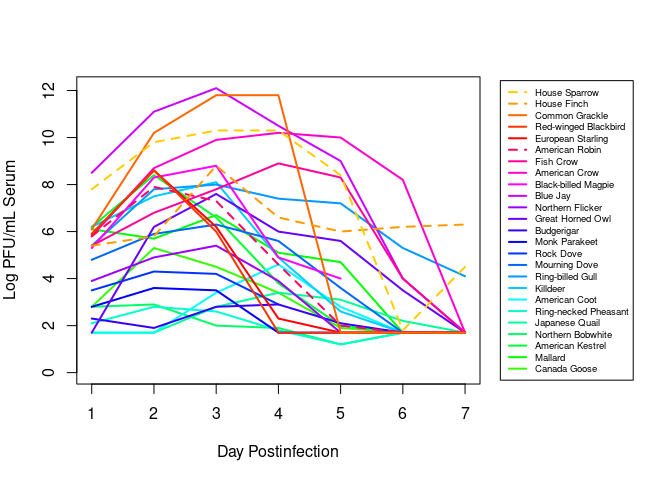

Wk1 Plot - Viremia
================
Norah Saarman
Aug 28, 2025

- [Line Plot](#line-plot)
- [Barplot](#barplot)

## Line Plot

``` r
# Import data and name columns
viremia <- read.csv("./data/viremia_data_days1to7.csv")
colnames(viremia) <- c("Bird","n","Species",
            "Family","Order","1","2","3","4","5","6","7")

# Choose some colors
cols <- c(rainbow(30)[c(10:29,1:5)])  # rainbow colors

# Choose some line types 
ltype <- as.numeric(viremia[,1] %in% c("American Robin","House Finch","House Sparrow")+1)

# Expand right margin of plot to fit
par(mar=c(5,4,4,10))

# Plot by species
plot(c(1:7), as.numeric(viremia[1, 6:12]), 
     type="l", lwd=2, col = cols[1],
     ylim=c(0,max(viremia[,6:12], na.rm=TRUE)),
     xlab="Day Postinfection", 
     ylab="Log PFU/mL Serum")
for(i in 2:nrow(viremia)){ # Add rows in loop
  lines(c(1:7), 
        as.numeric(viremia[i, 6:12]), 
        lwd=2, lty = ltype[i], col=cols[i])
}
# Legend (reversed order to match barplot below)
legend("right", inset=c(-0.38,0),  
       legend = rev(viremia$Bird), 
       col    = rev(cols),
       lty    = rev(ltype), 
       lwd=2, cex=0.6, xpd=TRUE)
```

<!-- -->

## Barplot

``` r
# Manually transcribe duration (mean, lo, hi) from the last table column
duration <- data.frame(
  Bird = c("Canada Goose","Mallard", 
           "American Kestrel","Northern Bobwhite",
           "Japanese Quail","Ring-necked Pheasant",
           "American Coot","Killdeer",
           "Ring-billed Gull","Mourning Dove",
           "Rock Dove","Monk Parakeet",
           "Budgerigar","Great Horned Owl",
           "Northern Flicker","Blue Jay",
           "Black-billed Magpie","American Crow",
           "Fish Crow","American Robin",
           "European Starling","Red-winged Blackbird",
           "Common Grackle","House Finch","House Sparrow"),
  mean = c(4.0,4.0,4.5,4.0,1.3,3.7,4.0,4.5,5.5,3.7,3.2,2.7,1.7,6.0,4.0,
           4.0,5.0,3.8,5.0,4.5,3.2,3.0,3.3,6.0,4.5),
  lo   = c(3,4,4,3,0,3,4,4,4,3,3,1,0,6,3,
           3,5,3,4,4,3,3,3,5,2),
  hi   = c(5,4,5,5,4,4,4,5,7,4,4,4,4,6,5,
           5,5,5,7,5,4,3,4,7,6)
)

# match colors to your species plot
cols <- c(rainbow(30)[c(10:29,1:5)])  # rainbow colors

# horizontal barplot
par(mar=c(5,12,2,2))  # wider left margin for names
bp <- barplot(duration$mean, horiz=TRUE, names.arg=duration$Bird,
              las=1, col=cols, xlab="Days of detectable viremia", xlim=c(0,7))

# add error bars
arrows(duration$lo, bp, duration$hi, bp,
       angle=90, code=3, length=0.05, col="black", xpd=TRUE)
```


