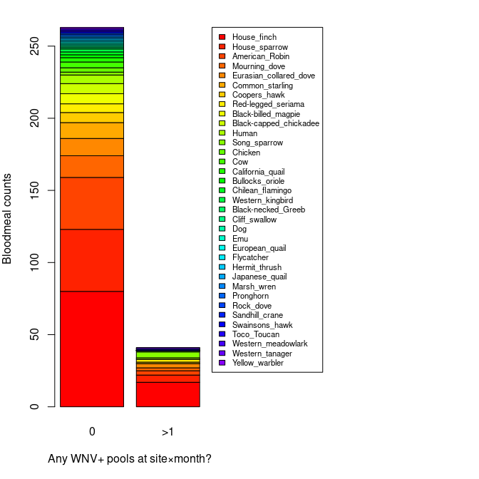
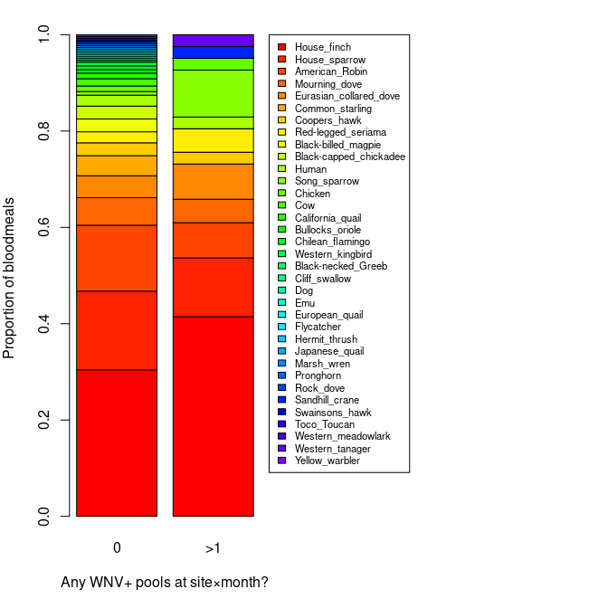

Wk3 - Uniting WNV & Bloodmeal Datasets
================
Norah Saarman
Sep 9, 2025

- [PIP ONLY](#pip-only)
  - [Pip - Bloodmeal COi Sequences pipiens
    only](#pip---bloodmeal-coi-sequences-pipiens-only)
  - [Pip - WNV test status by mosquito
    pool](#pip---wnv-test-status-by-mosquito-pool)
  - [Pip - Overlap by loc_year_month](#pip---overlap-by-loc_year_month)
  - [Pip - Collapse to counts](#pip---collapse-to-counts)
    - [Pip - Narrow format only one host_species
      column…](#pip---narrow-format-only-one-host_species-column)
    - [Pip - Wide format counts](#pip---wide-format-counts)
  - [Pip - Stacked barplot of host composition by loc_positives (0 vs
    1)](#pip---stacked-barplot-of-host-composition-by-loc_positives-0-vs-1)
  - [Pip - Fisher’s Exact Tests](#pip---fishers-exact-tests)
    - [Pip - House finch over-represented in locations with \>1 positive
      pool?](#pip---house-finch-over-represented-in-locations-with-1-positive-pool)
    - [Pip - Song sparrow over-represented in locations with \>1
      positive
      pool?](#pip---song-sparrow-over-represented-in-locations-with-1-positive-pool)
  - [Pip - GLM Song Sparrow](#pip---glm-song-sparrow)
  - [Pip - GLM house finch](#pip---glm-house-finch)
- [ALL DATA](#all-data)
  - [PipTar - Bloodmeal COi
    Sequences](#piptar---bloodmeal-coi-sequences)
  - [PipTar - WNV test status by mosquito
    pool](#piptar---wnv-test-status-by-mosquito-pool)
  - [PipTar - Overlap by loc_year_month +
    mosq_species](#piptar---overlap-by-loc_year_month--mosq_species)
  - [PipTar - Collapse to counts](#piptar---collapse-to-counts)
    - [PipTar - Narrow format only one host_species
      column…](#piptar---narrow-format-only-one-host_species-column)
    - [PipTar - Wide format counts](#piptar---wide-format-counts)
  - [PipTar - Stacked barplot of host composition by loc_positives (0 vs
    1)](#piptar---stacked-barplot-of-host-composition-by-loc_positives-0-vs-1)
  - [PipTar - Fisher’s Exact Tests](#piptar---fishers-exact-tests)
    - [PipTar - House finch over-represented in locations with \>1
      positive
      pool?](#piptar---house-finch-over-represented-in-locations-with-1-positive-pool)
    - [PipTar - Song sparrow over-represented in locations with \>1
      positive
      pool?](#piptar---song-sparrow-over-represented-in-locations-with-1-positive-pool)
    - [PipTar - Maybe its the mosquito?
      YES](#piptar---maybe-its-the-mosquito-yes)
  - [GLM Mosquito (and Song Sparrow)](#glm-mosquito-and-song-sparrow)
  - [GLM Mosquito (and house finch)](#glm-mosquito-and-house-finch)
    - [NOTE: I would explore host/mosquito species in pool a little
      more…](#note-i-would-explore-hostmosquito-species-in-pool-a-little-more)

# PIP ONLY

Cx_pipiens_sl only, dropping other data

## Pip - Bloodmeal COi Sequences pipiens only

``` r
blood_raw <- read.csv("bloodmeal_for_BIOL3070.csv", stringsAsFactors = FALSE)

blood <- data.frame(
  date           = as.Date(blood_raw$Collection.Date, 
                           tryFormats = c("%Y-%m-%d","%m/%d/%Y")),
  year           = blood_raw$year,
  month          = blood_raw$month,
  lat            = blood_raw$Lat,
  long           = blood_raw$Long,
  loc_name       = blood_raw$Location,
  loc_code       = blood_raw$site_code,
  loc_year_month = blood_raw$loc_year_month,
  mosq_species   = blood_raw$mosq_species,
  host_species   = blood_raw$host_species,
  host_common   = blood_raw$host_common,
  host_method   = blood_raw$host_method,
  BIOL3070_seqID = blood_raw$SEQ..BIOL3070
)

# Drop Cx_erythrothorax and Cx_tarsalis
blood <- subset(blood, mosq_species != "Cx_erythrothorax")
blood <- subset(blood, mosq_species != "Cx_tarsalis")

head(blood)
```

    ##       date year month      lat      long        loc_name loc_code
    ## 1 21-08-11 2021     8 40.75233 -111.9184  Fire Station 6      231
    ## 2 20-05-26 2020     5 40.74805 -111.9679            Keto       60
    ## 3 20-05-26 2020     5 40.74805 -111.9679            Keto       60
    ## 4 18-07-05 2018     7 40.77633 -111.8990  Fire Station 2      214
    ## 5 18-07-30 2018     7 40.72365 -111.8227 Fire Station 13      218
    ## 6 18-06-27 2018     6 40.74222 -111.8755    Tracy Aviary      207
    ##    loc_year_month  mosq_species             host_species      host_common
    ## 1 site231_2021.08 Cx_pipiens_sl        Passer_domesticus    House_sparrow
    ## 2 site060_2020.05 Cx_pipiens_sl         Sturnus_vulgaris  Common_starling
    ## 3 site060_2020.05 Cx_pipiens_sl       Turdus_migratorius   American_Robin
    ## 4 site214_2018.07 Cx_pipiens_sl        Passer_domesticus    House_sparrow
    ## 5 site218_2018.07 Cx_pipiens_sl       Turdus_migratorius   American_Robin
    ## 6 site207_2018.06 Cx_pipiens_sl Phoenicopterus_chilensis Chilean_flamingo
    ##       host_method BIOL3070_seqID
    ## 1          SPAdes          SQ001
    ## 2          Sanger               
    ## 3 NPS.BWAmem.2024               
    ## 4          SPAdes          SQ002
    ## 5          SPAdes          SQ003
    ## 6          SPAdes          SQ004

## Pip - WNV test status by mosquito pool

``` r
pools_raw <- read.csv("mosquito_pools_WNV.csv", stringsAsFactors = FALSE)

pools <- data.frame(
  agency_pool_num = pools_raw$agency_pool_num,
  mosq_species    = pools_raw$mosq_species,
  num_count       = pools_raw$num_count,
  date            = as.Date(pools_raw$collection_date, 
                            tryFormats = c("%Y-%m-%d","%m/%d/%Y")),
  year            = pools_raw$year,
  month           = pools_raw$month,
  lat             = pools_raw$longitude,
  long            = pools_raw$latitude,
  loc_code        = pools_raw$site_code,
  loc_name        = pools_raw$site_name,
  loc_year_month = pools_raw$loc_year_month,
  test_status     = pools_raw$test_status
)

# Drop Cx_erythrothorax and Cx_tarsalis
blood <- subset(blood, mosq_species != "Cx_erythrothorax")
blood <- subset(blood, mosq_species != "Cx_tarsalis")

head(pools)
```

    ##   agency_pool_num  mosq_species num_count       date year month      lat
    ## 1             147   Cx_tarsalis       100 2019-08-05 2019     8 -111.944
    ## 2             539   Cx_tarsalis        79 2019-07-29 2019     7 -111.944
    ## 3             846 Cx_pipiens_sl       100 2019-08-26 2019     8 -111.944
    ## 4             919 Cx_pipiens_sl       100 2019-09-03 2019     9 -111.944
    ## 5             920 Cx_pipiens_sl        93 2019-09-03 2019     9 -111.944
    ## 6            1012 Cx_pipiens_sl       100 2019-09-09 2019     9 -111.944
    ##       long loc_code loc_name  loc_year_month test_status
    ## 1 40.82646       29      ATV site029_2019.08   Confirmed
    ## 2 40.82646       29      ATV site029_2019.07   Confirmed
    ## 3 40.82646       29      ATV site029_2019.08   Confirmed
    ## 4 40.82646       29      ATV site029_2019.09   Confirmed
    ## 5 40.82646       29      ATV site029_2019.09   Confirmed
    ## 6 40.82646       29      ATV site029_2019.09   Confirmed

## Pip - Overlap by loc_year_month

``` r
# Inner join by loc_year_month
overlap <- merge(
  blood,
  pools,
  by = c("loc_year_month")
)

head(overlap); str(overlap)
```

    ##    loc_year_month   date.x year.x month.x    lat.x    long.x loc_name.x
    ## 1 site001_2020.07 20-07-09   2020       7 40.81567 -111.9423 RAC Soccer
    ## 2 site001_2020.07 20-07-09   2020       7 40.81567 -111.9423 RAC Soccer
    ## 3 site001_2020.07 20-07-09   2020       7 40.81567 -111.9423 RAC Soccer
    ## 4 site001_2020.07 20-07-09   2020       7 40.81567 -111.9423 RAC Soccer
    ## 5 site001_2020.07 20-07-09   2020       7 40.81567 -111.9423 RAC Soccer
    ## 6 site001_2020.07 20-07-09   2020       7 40.81567 -111.9423 RAC Soccer
    ##   loc_code.x mosq_species.x         host_species host_common     host_method
    ## 1          1  Cx_pipiens_sl Haemorhous_mexicanus House_finch NPS.BWAmem.2024
    ## 2          1  Cx_pipiens_sl Haemorhous_mexicanus House_finch NPS.BWAmem.2024
    ## 3          1  Cx_pipiens_sl Haemorhous_mexicanus House_finch NPS.BWAmem.2024
    ## 4          1  Cx_pipiens_sl Haemorhous_mexicanus House_finch NPS.BWAmem.2024
    ## 5          1  Cx_pipiens_sl Haemorhous_mexicanus House_finch NPS.BWAmem.2024
    ## 6          1  Cx_pipiens_sl Haemorhous_mexicanus House_finch NPS.BWAmem.2024
    ##   BIOL3070_seqID agency_pool_num mosq_species.y num_count     date.y year.y
    ## 1                             53    Cx_tarsalis       100 2020-07-09   2020
    ## 2                            119    Cx_tarsalis       100 2020-07-14   2020
    ## 3                            120    Cx_tarsalis       100 2020-07-14   2020
    ## 4                            261    Cx_tarsalis       100 2020-07-30   2020
    ## 5                             52    Cx_tarsalis       100 2020-07-09   2020
    ## 6                            260    Cx_tarsalis       100 2020-07-30   2020
    ##   month.y     lat.y   long.y loc_code.y loc_name.y test_status
    ## 1       7 -111.9423 40.81567          1 RAC Soccer    Negative
    ## 2       7 -111.9423 40.81567          1 RAC Soccer    Negative
    ## 3       7 -111.9423 40.81567          1 RAC Soccer    Negative
    ## 4       7 -111.9423 40.81567          1 RAC Soccer    Negative
    ## 5       7 -111.9423 40.81567          1 RAC Soccer    Negative
    ## 6       7 -111.9423 40.81567          1 RAC Soccer    Negative

    ## 'data.frame':    1219 obs. of  24 variables:
    ##  $ loc_year_month : chr  "site001_2020.07" "site001_2020.07" "site001_2020.07" "site001_2020.07" ...
    ##  $ date.x         : Date, format: "20-07-09" "20-07-09" ...
    ##  $ year.x         : int  2020 2020 2020 2020 2020 2020 2020 2020 2020 2020 ...
    ##  $ month.x        : int  7 7 7 7 7 7 7 7 7 7 ...
    ##  $ lat.x          : num  40.8 40.8 40.8 40.8 40.8 ...
    ##  $ long.x         : num  -112 -112 -112 -112 -112 ...
    ##  $ loc_name.x     : chr  "RAC Soccer" "RAC Soccer" "RAC Soccer" "RAC Soccer" ...
    ##  $ loc_code.x     : int  1 1 1 1 1 1 1 1 1 1 ...
    ##  $ mosq_species.x : chr  "Cx_pipiens_sl" "Cx_pipiens_sl" "Cx_pipiens_sl" "Cx_pipiens_sl" ...
    ##  $ host_species   : chr  "Haemorhous_mexicanus" "Haemorhous_mexicanus" "Haemorhous_mexicanus" "Haemorhous_mexicanus" ...
    ##  $ host_common    : chr  "House_finch" "House_finch" "House_finch" "House_finch" ...
    ##  $ host_method    : chr  "NPS.BWAmem.2024" "NPS.BWAmem.2024" "NPS.BWAmem.2024" "NPS.BWAmem.2024" ...
    ##  $ BIOL3070_seqID : chr  "" "" "" "" ...
    ##  $ agency_pool_num: int  53 119 120 261 52 260 259 53 119 120 ...
    ##  $ mosq_species.y : chr  "Cx_tarsalis" "Cx_tarsalis" "Cx_tarsalis" "Cx_tarsalis" ...
    ##  $ num_count      : int  100 100 100 100 100 100 58 100 100 100 ...
    ##  $ date.y         : Date, format: "2020-07-09" "2020-07-14" ...
    ##  $ year.y         : int  2020 2020 2020 2020 2020 2020 2020 2020 2020 2020 ...
    ##  $ month.y        : int  7 7 7 7 7 7 7 7 7 7 ...
    ##  $ lat.y          : num  -112 -112 -112 -112 -112 ...
    ##  $ long.y         : num  40.8 40.8 40.8 40.8 40.8 ...
    ##  $ loc_code.y     : int  1 1 1 1 1 1 1 1 1 1 ...
    ##  $ loc_name.y     : chr  "RAC Soccer" "RAC Soccer" "RAC Soccer" "RAC Soccer" ...
    ##  $ test_status    : chr  "Negative" "Negative" "Negative" "Negative" ...

``` r
write.csv(overlap, "overlap_bloodmeal_WNV_pip_only.csv", row.names = FALSE)


nrow(overlap)
```

    ## [1] 1219

## Pip - Collapse to counts

Host species, and counts of confirmed/negative WNV pools by
loc_year_month.

### Pip - Narrow format only one host_species column…

``` r
## 1) Bloodmeal counts: host species per key
host_counts <- aggregate(
  x = list(n_bloodmeals = rep(1, nrow(blood))),
  by = list(
    loc_year_month = blood$loc_year_month,
    mosq_species   = blood$mosq_species,
    host_common   = blood$host_common
  ),
  FUN = sum
)

## 2) WNV pool counts: test status per key
pool_counts_long <- aggregate(
  x = list(n_pools = rep(1, nrow(pools))),
  by = list(
    loc_year_month = pools$loc_year_month,
    mosq_species   = pools$mosq_species,
    test_status    = pools$test_status
  ),
  FUN = sum
)

## 3) Make Confirmed/Negative columns (keep both; fill missing with 0)
pc_conf <- subset(pool_counts_long, test_status == "Confirmed")[, c("loc_year_month","mosq_species","n_pools")]
names(pc_conf)[3] <- "pools_confirmed"

pc_neg  <- subset(pool_counts_long, test_status == "Negative")[, c("loc_year_month","mosq_species","n_pools")]
names(pc_neg)[3] <- "pools_negative"

pool_counts_wide <- merge(pc_conf, pc_neg, by = c("loc_year_month","mosq_species"), all = TRUE)
pool_counts_wide$pools_confirmed[is.na(pool_counts_wide$pools_confirmed)] <- 0
pool_counts_wide$pools_negative[is.na(pool_counts_wide$pools_negative)]   <- 0

## 4) Join: host × (confirmed/negative) per key; keep ALL host_species
counts <- merge(
  host_counts,
  pool_counts_wide,
  by = c("loc_year_month","mosq_species"),
  all.x = TRUE
)

## replace NAs for pool counts with 0 (keys with blood meals but no pools)
counts$pools_confirmed[is.na(counts$pools_confirmed)] <- 0
counts$pools_negative[is.na(counts$pools_negative)]   <- 0

## check
head(counts)
```

    ##    loc_year_month  mosq_species         host_common n_bloodmeals
    ## 1 site001_2020.06 Cx_pipiens_sl      American_Robin            1
    ## 2 site001_2020.06 Cx_pipiens_sl Black-billed_magpie            1
    ## 3 site001_2020.07 Cx_pipiens_sl      American_Robin            1
    ## 4 site001_2020.07 Cx_pipiens_sl         House_finch            1
    ## 5 site001_2021.08 Cx_pipiens_sl      American_Robin            1
    ## 6 site005_2020.07 Cx_pipiens_sl         House_finch            1
    ##   pools_confirmed pools_negative
    ## 1               0              0
    ## 2               0              0
    ## 3               0              1
    ## 4               0              1
    ## 5               1              3
    ## 6               0              0

``` r
sum(counts$n_bloodmeals)  
```

    ## [1] 293

### Pip - Wide format counts

For CCA (or RDA, PERMANOVA, etc.) you want the host species as separate
columns, one per species, with counts filled in (0 if absent). That way
you have a site × time × mosquito species matrix of bird hosts.

``` r
## 1) Bloodmeal counts: wide by host species
host_counts <- aggregate(
  x = list(n_bloodmeals = rep(1, nrow(blood))),
  by = list(
    loc_year_month = blood$loc_year_month,
    mosq_species   = blood$mosq_species,
    host_common   = blood$host_common
  ),
  FUN = sum
)

## reshape wide: each host_species becomes its own column
host_counts_wide <- reshape(
  host_counts,
  idvar   = c("loc_year_month","mosq_species"),
  timevar = "host_common",
  direction = "wide"
)

## clean names: host_species -> host_xxx
names(host_counts_wide) <- sub("^n_bloodmeals\\.", "host_", names(host_counts_wide))

## replace NAs with 0 (no samples of that host at that site/month/species)
host_counts_wide[is.na(host_counts_wide)] <- 0

## 2) Pool counts: confirmed/negative (same as before)
pool_counts_long <- aggregate(
  x = list(n_pools = rep(1, nrow(pools))),
  by = list(
    loc_year_month = pools$loc_year_month,
    mosq_species   = pools$mosq_species,
    test_status    = pools$test_status
  ),
  FUN = sum
)

pc_conf <- subset(pool_counts_long, test_status == "Confirmed")[, c("loc_year_month","mosq_species","n_pools")]
names(pc_conf)[3] <- "pools_confirmed"

pc_neg <- subset(pool_counts_long, test_status == "Negative")[, c("loc_year_month","mosq_species","n_pools")]
names(pc_neg)[3] <- "pools_negative"

pool_counts_wide <- merge(pc_conf, pc_neg, by = c("loc_year_month","mosq_species"), all = TRUE)
pool_counts_wide$pools_confirmed[is.na(pool_counts_wide$pools_confirmed)] <- 0
pool_counts_wide$pools_negative[is.na(pool_counts_wide$pools_negative)]   <- 0

## 3) Final join: host × pools
counts_matrix <- merge(
  host_counts_wide,
  pool_counts_wide,
  by = c("loc_year_month","mosq_species"),
  all = TRUE
)

## replace NAs with 0 after join
counts_matrix[is.na(counts_matrix)] <- 0

# Did I loose any host data?
# Identify host columns (everything starting with "host_")
host_cols <- grep("^host_", names(counts_matrix))

# Sum all host counts across the matrix
sum(counts_matrix[ , host_cols])
```

    ## [1] 293

``` r
# add a column for location specific positives:
# Compute whether any positives occurred at each site×month
loc_pos <- aggregate(
  pools_confirmed ~ loc_year_month,
  counts_matrix,
  function(x) as.integer(sum(x) > 0)
)
names(loc_pos)[2] <- "loc_positives"

# Join back into your main matrix
counts_matrix <- merge(counts_matrix, loc_pos, by = "loc_year_month", all.x = TRUE)

# Quick check
table(counts_matrix$loc_positives)  # 0 = no positives that month; 1 = at least one positive
```

    ## 
    ##    0    1 
    ## 1060  268

``` r
## Save
out_file <- "overlap_bloodmeal_WNV_counts_pip_only.csv"
write.csv(counts_matrix, out_file, row.names = FALSE)
```

## Pip - Stacked barplot of host composition by loc_positives (0 vs 1)

``` r
## 1) Identify host columns
host_cols <- grep("^host_", names(counts_matrix), value = TRUE)

## 2) Aggregate host counts by loc_positives (0/1)
agg <- aggregate(counts_matrix[, host_cols, drop = FALSE],
                 by = list(loc_positives = counts_matrix$loc_positives),
                 FUN = sum)

## ensure order is 0,1 if both exist
agg <- agg[order(agg$loc_positives), , drop = FALSE]

## 3) Order host columns by overall abundance for a nicer legend
totals <- colSums(agg[, host_cols, drop = FALSE])
host_order <- names(sort(totals, decreasing = TRUE))

## 4) Build matrices for plotting
mat_counts <- t(as.matrix(agg[, host_order, drop = FALSE]))  # rows=hosts, cols=loc_positives groups
colnames(mat_counts) <- paste0("loc_positives=", agg$loc_positives)

## 5) Colors and labels
n_hosts <- nrow(mat_counts)
cols <- rainbow(n_hosts+10)
leg_labs <- sub("^host_", "", rownames(mat_counts))  # cleaner legend labels

mat_counts
```

    ##                             loc_positives=0 loc_positives=1
    ## host_House_finch                         78              17
    ## host_House_sparrow                       43               5
    ## host_American_Robin                      35               3
    ## host_Mourning_dove                       15               2
    ## host_Eurasian_collared_dove              12               3
    ## host_Common_starling                     11               0
    ## host_Coopers_hawk                         7               1
    ## host_Red-legged_seriama                   6               2
    ## host_Black-billed_magpie                  7               0
    ## host_Black-capped_chickadee               7               0
    ## host_Human                                6               1
    ## host_Song_sparrow                         2               4
    ## host_California_quail                     3               0
    ## host_Chicken                              2               1
    ## host_Bullocks_oriole                      2               0
    ## host_Chilean_flamingo                     2               0
    ## host_Western_kingbird                     2               0
    ## host_Cliff_swallow                        1               0
    ## host_Cow                                  1               0
    ## host_Dog                                  1               0
    ## host_Emu                                  1               0
    ## host_European_quail                       1               0
    ## host_Flycatcher                           1               0
    ## host_Hermit_thrush                        1               0
    ## host_Japanese_quail                       1               0
    ## host_Rock_dove                            1               0
    ## host_Sandhill_crane                       0               1
    ## host_Toco_Toucan                          1               0
    ## host_Western_meadowlark                   1               0
    ## host_Western_tanager                      0               1
    ## host_Yellow_warbler                       1               0

``` r
## 6a) Stacked barplot — COUNTS
op <- par(mar = c(5, 4, 2, 20))  # extra right margin for legend
barplot(mat_counts, beside = FALSE, col = cols,
        names.arg = c("0",">1"),
        ylab = "Bloodmeal counts",
        xlab = "Any WNV+ pools at site×month?")
legend("topright", inset = c(-0.78, 0), xpd = TRUE,
       legend = leg_labs, fill = cols, cex = 0.7)
```


``` r
par(op)

## 6b) (Optional) Stacked barplot — PROPORTIONS
mat_props <- apply(mat_counts, 2, function(x) if (sum(x) > 0) x / sum(x) else x)
op <- par(mar = c(5, 4, 2, 20))
barplot(mat_props, beside = FALSE, col = cols,
        names.arg = c("0",">1"),
        ylab = "Proportion of bloodmeals",
        xlab = "Any WNV+ pools at site×month?")
legend("topright", inset = c(-0.78, 0), xpd = TRUE,
       legend = leg_labs, fill = cols, cex = 0.7)
```


``` r
par(op)
```

## Pip - Fisher’s Exact Tests

### Pip - House finch over-represented in locations with \>1 positive pool?

``` r
# Build 2x2 for House Finch
hf_table <- matrix(c(
  17,  # Finch in loc_positive=1
  78,  # Finch in loc_positive=0
  sum(counts_matrix$loc_positives) - 17,  # All other hosts in positive
  sum(1 - counts_matrix$loc_positives) - 78  # All other hosts in negative
), nrow = 2, byrow = TRUE)

fisher.test(hf_table)
```

    ## 
    ##  Fisher's Exact Test for Count Data
    ## 
    ## data:  hf_table
    ## p-value = 0.6905
    ## alternative hypothesis: true odds ratio is not equal to 1
    ## 95 percent confidence interval:
    ##  0.4643072 1.4864642
    ## sample estimates:
    ## odds ratio 
    ##  0.8527921

### Pip - Song sparrow over-represented in locations with \>1 positive pool?

(I just happened to notice from the bar plot that it looks to be)…

``` r
# Build 2x2 for Song Sparrow
ss_table <- matrix(c(
  4,  # Sparrow in loc_positive=1
  2,  # Sparrow in loc_positive=0
  sum(counts_matrix$loc_positives) - 4,
  sum(1 - counts_matrix$loc_positives) - 2
), nrow = 2, byrow = TRUE)

fisher.test(ss_table)
```

    ## 
    ##  Fisher's Exact Test for Count Data
    ## 
    ## data:  ss_table
    ## p-value = 0.01729
    ## alternative hypothesis: true odds ratio is not equal to 1
    ## 95 percent confidence interval:
    ##   1.139335 88.983366
    ## sample estimates:
    ## odds ratio 
    ##   7.997576

## Pip - GLM Song Sparrow

Does song sparrow have an effect in pip only data? Maybe?

``` r
#glm with bird
glm1 <- glm(loc_positives ~ host_Song_sparrow,
            data = counts_matrix,
            family = binomial)
summary(glm1)
```

    ## 
    ## Call:
    ## glm(formula = loc_positives ~ host_Song_sparrow, family = binomial, 
    ##     data = counts_matrix)
    ## 
    ## Coefficients:
    ##                   Estimate Std. Error z value Pr(>|z|)    
    ## (Intercept)       -1.38168    0.06858 -20.146   <2e-16 ***
    ## host_Song_sparrow  1.15590    0.78571   1.471    0.141    
    ## ---
    ## Signif. codes:  0 '***' 0.001 '**' 0.01 '*' 0.05 '.' 0.1 ' ' 1
    ## 
    ## (Dispersion parameter for binomial family taken to be 1)
    ## 
    ##     Null deviance: 1335.7  on 1327  degrees of freedom
    ## Residual deviance: 1332.6  on 1326  degrees of freedom
    ## AIC: 1336.6
    ## 
    ## Number of Fisher Scoring iterations: 4

## Pip - GLM house finch

Does house finch have an effect in pip only data? NO.

``` r
#glm with bird
glm1 <- glm(loc_positives ~ host_House_finch,
            data = counts_matrix,
            family = binomial)
summary(glm1)
```

    ## 
    ## Call:
    ## glm(formula = loc_positives ~ host_House_finch, family = binomial, 
    ##     data = counts_matrix)
    ## 
    ## Coefficients:
    ##                  Estimate Std. Error z value Pr(>|z|)    
    ## (Intercept)      -1.37120    0.06924 -19.803   <2e-16 ***
    ## host_House_finch -0.05617    0.16788  -0.335    0.738    
    ## ---
    ## Signif. codes:  0 '***' 0.001 '**' 0.01 '*' 0.05 '.' 0.1 ' ' 1
    ## 
    ## (Dispersion parameter for binomial family taken to be 1)
    ## 
    ##     Null deviance: 1335.7  on 1327  degrees of freedom
    ## Residual deviance: 1335.6  on 1326  degrees of freedom
    ## AIC: 1339.6
    ## 
    ## Number of Fisher Scoring iterations: 4

# ALL DATA

All data available, pip and tars Uniting WNV and Bloodmeal COi Sequences

## PipTar - Bloodmeal COi Sequences

``` r
blood_raw <- read.csv("bloodmeal_for_BIOL3070.csv", stringsAsFactors = FALSE)

blood <- data.frame(
  date           = as.Date(blood_raw$Collection.Date, 
                           tryFormats = c("%Y-%m-%d","%m/%d/%Y")),
  year           = blood_raw$year,
  month          = blood_raw$month,
  lat            = blood_raw$Lat,
  long           = blood_raw$Long,
  loc_name       = blood_raw$Location,
  loc_code       = blood_raw$site_code,
  loc_year_month = blood_raw$loc_year_month,
  mosq_species   = blood_raw$mosq_species,
  host_species   = blood_raw$host_species,
  host_common   = blood_raw$host_common,
  host_method   = blood_raw$host_method,
  BIOL3070_seqID = blood_raw$SEQ..BIOL3070
)

# Drop Cx_erythrothorax
blood <- subset(blood, mosq_species != "Cx_erythrothorax")

head(blood)
```

    ##       date year month      lat      long        loc_name loc_code
    ## 1 21-08-11 2021     8 40.75233 -111.9184  Fire Station 6      231
    ## 2 20-05-26 2020     5 40.74805 -111.9679            Keto       60
    ## 3 20-05-26 2020     5 40.74805 -111.9679            Keto       60
    ## 4 18-07-05 2018     7 40.77633 -111.8990  Fire Station 2      214
    ## 5 18-07-30 2018     7 40.72365 -111.8227 Fire Station 13      218
    ## 6 18-06-27 2018     6 40.74222 -111.8755    Tracy Aviary      207
    ##    loc_year_month  mosq_species             host_species      host_common
    ## 1 site231_2021.08 Cx_pipiens_sl        Passer_domesticus    House_sparrow
    ## 2 site060_2020.05 Cx_pipiens_sl         Sturnus_vulgaris  Common_starling
    ## 3 site060_2020.05 Cx_pipiens_sl       Turdus_migratorius   American_Robin
    ## 4 site214_2018.07 Cx_pipiens_sl        Passer_domesticus    House_sparrow
    ## 5 site218_2018.07 Cx_pipiens_sl       Turdus_migratorius   American_Robin
    ## 6 site207_2018.06 Cx_pipiens_sl Phoenicopterus_chilensis Chilean_flamingo
    ##       host_method BIOL3070_seqID
    ## 1          SPAdes          SQ001
    ## 2          Sanger               
    ## 3 NPS.BWAmem.2024               
    ## 4          SPAdes          SQ002
    ## 5          SPAdes          SQ003
    ## 6          SPAdes          SQ004

## PipTar - WNV test status by mosquito pool

``` r
pools_raw <- read.csv("mosquito_pools_WNV.csv", stringsAsFactors = FALSE)

pools <- data.frame(
  agency_pool_num = pools_raw$agency_pool_num,
  mosq_species    = pools_raw$mosq_species,
  num_count       = pools_raw$num_count,
  date            = as.Date(pools_raw$collection_date, 
                            tryFormats = c("%Y-%m-%d","%m/%d/%Y")),
  year            = pools_raw$year,
  month           = pools_raw$month,
  lat             = pools_raw$longitude,
  long            = pools_raw$latitude,
  loc_code        = pools_raw$site_code,
  loc_name        = pools_raw$site_name,
  loc_year_month = pools_raw$loc_year_month,
  test_status     = pools_raw$test_status
)

# Drop Cx_erythrothorax
pools <- subset(pools, mosq_species != "Cx_erythrothorax")

head(pools)
```

    ##   agency_pool_num  mosq_species num_count       date year month      lat
    ## 1             147   Cx_tarsalis       100 2019-08-05 2019     8 -111.944
    ## 2             539   Cx_tarsalis        79 2019-07-29 2019     7 -111.944
    ## 3             846 Cx_pipiens_sl       100 2019-08-26 2019     8 -111.944
    ## 4             919 Cx_pipiens_sl       100 2019-09-03 2019     9 -111.944
    ## 5             920 Cx_pipiens_sl        93 2019-09-03 2019     9 -111.944
    ## 6            1012 Cx_pipiens_sl       100 2019-09-09 2019     9 -111.944
    ##       long loc_code loc_name  loc_year_month test_status
    ## 1 40.82646       29      ATV site029_2019.08   Confirmed
    ## 2 40.82646       29      ATV site029_2019.07   Confirmed
    ## 3 40.82646       29      ATV site029_2019.08   Confirmed
    ## 4 40.82646       29      ATV site029_2019.09   Confirmed
    ## 5 40.82646       29      ATV site029_2019.09   Confirmed
    ## 6 40.82646       29      ATV site029_2019.09   Confirmed

## PipTar - Overlap by loc_year_month + mosq_species

``` r
# Inner join by loc_year_month + mosq_species
overlap <- merge(
  blood,
  pools,
  by = c("loc_year_month", "mosq_species")
)

head(overlap); str(overlap)
```

    ##    loc_year_month  mosq_species   date.x year.x month.x    lat.x    long.x
    ## 1 site001_2020.07 Cx_pipiens_sl 20-07-01   2020       7 40.81567 -111.9423
    ## 2 site001_2020.07 Cx_pipiens_sl 20-07-09   2020       7 40.81567 -111.9423
    ## 3 site001_2021.08 Cx_pipiens_sl 21-08-19   2021       8 40.81567 -111.9423
    ## 4 site001_2021.08 Cx_pipiens_sl 21-08-19   2021       8 40.81567 -111.9423
    ## 5 site001_2021.08 Cx_pipiens_sl 21-08-19   2021       8 40.81567 -111.9423
    ## 6 site001_2021.08 Cx_pipiens_sl 21-08-19   2021       8 40.81567 -111.9423
    ##   loc_name.x loc_code.x         host_species    host_common     host_method
    ## 1 RAC Soccer          1   Turdus_migratorius American_Robin          SPAdes
    ## 2 RAC Soccer          1 Haemorhous_mexicanus    House_finch NPS.BWAmem.2024
    ## 3 RAC Soccer          1   Turdus_migratorius American_Robin          SPAdes
    ## 4 RAC Soccer          1   Turdus_migratorius American_Robin          SPAdes
    ## 5 RAC Soccer          1   Turdus_migratorius American_Robin          SPAdes
    ## 6 RAC Soccer          1   Turdus_migratorius American_Robin          SPAdes
    ##   BIOL3070_seqID agency_pool_num num_count     date.y year.y month.y     lat.y
    ## 1          SQ145             259        58 2020-07-30   2020       7 -111.9423
    ## 2                            259        58 2020-07-30   2020       7 -111.9423
    ## 3          SQ037             837        49 2021-08-24   2021       8 -111.9423
    ## 4          SQ037             641        64 2021-08-10   2021       8 -111.9423
    ## 5          SQ037             760        54 2021-08-17   2021       8 -111.9423
    ## 6          SQ037             547        93 2021-08-04   2021       8 -111.9423
    ##     long.y loc_code.y loc_name.y test_status
    ## 1 40.81567          1 RAC Soccer    Negative
    ## 2 40.81567          1 RAC Soccer    Negative
    ## 3 40.81567          1 RAC Soccer    Negative
    ## 4 40.81567          1 RAC Soccer   Confirmed
    ## 5 40.81567          1 RAC Soccer    Negative
    ## 6 40.81567          1 RAC Soccer    Negative

    ## 'data.frame':    1012 obs. of  23 variables:
    ##  $ loc_year_month : chr  "site001_2020.07" "site001_2020.07" "site001_2021.08" "site001_2021.08" ...
    ##  $ mosq_species   : chr  "Cx_pipiens_sl" "Cx_pipiens_sl" "Cx_pipiens_sl" "Cx_pipiens_sl" ...
    ##  $ date.x         : Date, format: "20-07-01" "20-07-09" ...
    ##  $ year.x         : int  2020 2020 2021 2021 2021 2021 2020 2020 2020 2020 ...
    ##  $ month.x        : int  7 7 8 8 8 8 7 7 7 7 ...
    ##  $ lat.x          : num  40.8 40.8 40.8 40.8 40.8 ...
    ##  $ long.x         : num  -112 -112 -112 -112 -112 ...
    ##  $ loc_name.x     : chr  "RAC Soccer" "RAC Soccer" "RAC Soccer" "RAC Soccer" ...
    ##  $ loc_code.x     : int  1 1 1 1 1 1 25 25 25 25 ...
    ##  $ host_species   : chr  "Turdus_migratorius" "Haemorhous_mexicanus" "Turdus_migratorius" "Turdus_migratorius" ...
    ##  $ host_common    : chr  "American_Robin" "House_finch" "American_Robin" "American_Robin" ...
    ##  $ host_method    : chr  "SPAdes" "NPS.BWAmem.2024" "SPAdes" "SPAdes" ...
    ##  $ BIOL3070_seqID : chr  "SQ145" "" "SQ037" "SQ037" ...
    ##  $ agency_pool_num: int  259 259 837 641 760 547 125 129 240 128 ...
    ##  $ num_count      : int  58 58 49 64 54 93 24 100 100 69 ...
    ##  $ date.y         : Date, format: "2020-07-30" "2020-07-30" ...
    ##  $ year.y         : int  2020 2020 2021 2021 2021 2021 2020 2020 2020 2020 ...
    ##  $ month.y        : int  7 7 8 8 8 8 7 7 7 7 ...
    ##  $ lat.y          : num  -112 -112 -112 -112 -112 ...
    ##  $ long.y         : num  40.8 40.8 40.8 40.8 40.8 ...
    ##  $ loc_code.y     : int  1 1 1 1 1 1 25 25 25 25 ...
    ##  $ loc_name.y     : chr  "RAC Soccer" "RAC Soccer" "RAC Soccer" "RAC Soccer" ...
    ##  $ test_status    : chr  "Negative" "Negative" "Negative" "Confirmed" ...

``` r
write.csv(overlap, "overlap_bloodmeal_WNV_pip_tar.csv", row.names = FALSE)


nrow(overlap)
```

    ## [1] 1012

## PipTar - Collapse to counts

Host species, and counts of confirmed/negative WNV pools by
loc_year_month × mosq_species.

### PipTar - Narrow format only one host_species column…

``` r
## 1) Bloodmeal counts: host species per key
host_counts <- aggregate(
  x = list(n_bloodmeals = rep(1, nrow(blood))),
  by = list(
    loc_year_month = blood$loc_year_month,
    mosq_species   = blood$mosq_species,
    host_common   = blood$host_common
  ),
  FUN = sum
)

## 2) WNV pool counts: test status per key
pool_counts_long <- aggregate(
  x = list(n_pools = rep(1, nrow(pools))),
  by = list(
    loc_year_month = pools$loc_year_month,
    mosq_species   = pools$mosq_species,
    test_status    = pools$test_status
  ),
  FUN = sum
)

## 3) Make Confirmed/Negative columns (keep both; fill missing with 0)
pc_conf <- subset(pool_counts_long, test_status == "Confirmed")[, c("loc_year_month","mosq_species","n_pools")]
names(pc_conf)[3] <- "pools_confirmed"

pc_neg  <- subset(pool_counts_long, test_status == "Negative")[, c("loc_year_month","mosq_species","n_pools")]
names(pc_neg)[3] <- "pools_negative"

pool_counts_wide <- merge(pc_conf, pc_neg, by = c("loc_year_month","mosq_species"), all = TRUE)
pool_counts_wide$pools_confirmed[is.na(pool_counts_wide$pools_confirmed)] <- 0
pool_counts_wide$pools_negative[is.na(pool_counts_wide$pools_negative)]   <- 0

## 4) Join: host × (confirmed/negative) per key; keep ALL host_species
counts <- merge(
  host_counts,
  pool_counts_wide,
  by = c("loc_year_month","mosq_species"),
  all.x = TRUE
)

## replace NAs for pool counts with 0 (keys with blood meals but no pools)
counts$pools_confirmed[is.na(counts$pools_confirmed)] <- 0
counts$pools_negative[is.na(counts$pools_negative)]   <- 0

## check
head(counts)
```

    ##    loc_year_month  mosq_species         host_common n_bloodmeals
    ## 1 site001_2020.06 Cx_pipiens_sl      American_Robin            1
    ## 2 site001_2020.06 Cx_pipiens_sl Black-billed_magpie            1
    ## 3 site001_2020.07 Cx_pipiens_sl      American_Robin            1
    ## 4 site001_2020.07 Cx_pipiens_sl         House_finch            1
    ## 5 site001_2021.08 Cx_pipiens_sl      American_Robin            1
    ## 6 site005_2020.07 Cx_pipiens_sl         House_finch            1
    ##   pools_confirmed pools_negative
    ## 1               0              0
    ## 2               0              0
    ## 3               0              1
    ## 4               0              1
    ## 5               1              3
    ## 6               0              0

``` r
sum(counts$n_bloodmeals)  
```

    ## [1] 304

### PipTar - Wide format counts

For CCA (or RDA, PERMANOVA, etc.) you want the host species as separate
columns, one per species, with counts filled in (0 if absent). That way
you have a site × time × mosquito species matrix of bird hosts.

``` r
## 1) Bloodmeal counts: wide by host species
host_counts <- aggregate(
  x = list(n_bloodmeals = rep(1, nrow(blood))),
  by = list(
    loc_year_month = blood$loc_year_month,
    mosq_species   = blood$mosq_species,
    host_common   = blood$host_common
  ),
  FUN = sum
)

## reshape wide: each host_species becomes its own column
host_counts_wide <- reshape(
  host_counts,
  idvar   = c("loc_year_month","mosq_species"),
  timevar = "host_common",
  direction = "wide"
)

## clean names: host_species -> host_xxx
names(host_counts_wide) <- sub("^n_bloodmeals\\.", "host_", names(host_counts_wide))

## replace NAs with 0 (no samples of that host at that site/month/species)
host_counts_wide[is.na(host_counts_wide)] <- 0

## 2) Pool counts: confirmed/negative (same as before)
pool_counts_long <- aggregate(
  x = list(n_pools = rep(1, nrow(pools))),
  by = list(
    loc_year_month = pools$loc_year_month,
    mosq_species   = pools$mosq_species,
    test_status    = pools$test_status
  ),
  FUN = sum
)

pc_conf <- subset(pool_counts_long, test_status == "Confirmed")[, c("loc_year_month","mosq_species","n_pools")]
names(pc_conf)[3] <- "pools_confirmed"

pc_neg <- subset(pool_counts_long, test_status == "Negative")[, c("loc_year_month","mosq_species","n_pools")]
names(pc_neg)[3] <- "pools_negative"

pool_counts_wide <- merge(pc_conf, pc_neg, by = c("loc_year_month","mosq_species"), all = TRUE)
pool_counts_wide$pools_confirmed[is.na(pool_counts_wide$pools_confirmed)] <- 0
pool_counts_wide$pools_negative[is.na(pool_counts_wide$pools_negative)]   <- 0

## 3) Final join: host × pools
counts_matrix <- merge(
  host_counts_wide,
  pool_counts_wide,
  by = c("loc_year_month","mosq_species"),
  all = TRUE
)

## replace NAs with 0 after join
counts_matrix[is.na(counts_matrix)] <- 0

# Did I loose any host data?
# Identify host columns (everything starting with "host_")
host_cols <- grep("^host_", names(counts_matrix))

# Sum all host counts across the matrix
sum(counts_matrix[ , host_cols])
```

    ## [1] 304

``` r
# add a column for location specific positives:
# Compute whether any positives occurred at each site×month
loc_pos <- aggregate(
  pools_confirmed ~ loc_year_month,
  counts_matrix,
  function(x) as.integer(sum(x) > 0)
)
names(loc_pos)[2] <- "loc_positives"

# Join back into your main matrix
counts_matrix <- merge(counts_matrix, loc_pos, by = "loc_year_month", all.x = TRUE)

# Quick check
table(counts_matrix$loc_positives)  # 0 = no positives that month; 1 = at least one positive
```

    ## 
    ##    0    1 
    ## 1001  257

``` r
## Save
out_file <- "overlap_bloodmeal_WNV_counts_pip_tar.csv"
write.csv(counts_matrix, out_file, row.names = FALSE)
```

## PipTar - Stacked barplot of host composition by loc_positives (0 vs 1)

``` r
## 1) Identify host columns
host_cols <- grep("^host_", names(counts_matrix), value = TRUE)

## 2) Aggregate host counts by loc_positives (0/1)
agg <- aggregate(counts_matrix[, host_cols, drop = FALSE],
                 by = list(loc_positives = counts_matrix$loc_positives),
                 FUN = sum)

## ensure order is 0,1 if both exist
agg <- agg[order(agg$loc_positives), , drop = FALSE]

## 3) Order host columns by overall abundance for a nicer legend
totals <- colSums(agg[, host_cols, drop = FALSE])
host_order <- names(sort(totals, decreasing = TRUE))

## 4) Build matrices for plotting
mat_counts <- t(as.matrix(agg[, host_order, drop = FALSE]))  # rows=hosts, cols=loc_positives groups
colnames(mat_counts) <- paste0("loc_positives=", agg$loc_positives)

## 5) Colors and labels
n_hosts <- nrow(mat_counts)
cols <- rainbow(n_hosts+10)
leg_labs <- sub("^host_", "", rownames(mat_counts))  # cleaner legend labels

mat_counts
```

    ##                             loc_positives=0 loc_positives=1
    ## host_House_finch                         80              17
    ## host_House_sparrow                       43               5
    ## host_American_Robin                      36               3
    ## host_Mourning_dove                       15               2
    ## host_Eurasian_collared_dove              12               3
    ## host_Common_starling                     11               0
    ## host_Coopers_hawk                         7               1
    ## host_Red-legged_seriama                   6               2
    ## host_Black-billed_magpie                  7               0
    ## host_Black-capped_chickadee               7               0
    ## host_Human                                6               1
    ## host_Song_sparrow                         2               4
    ## host_Chicken                              3               1
    ## host_Cow                                  4               0
    ## host_California_quail                     3               0
    ## host_Bullocks_oriole                      2               0
    ## host_Chilean_flamingo                     2               0
    ## host_Western_kingbird                     2               0
    ## host_Black-necked_Greeb                   1               0
    ## host_Cliff_swallow                        1               0
    ## host_Dog                                  1               0
    ## host_Emu                                  1               0
    ## host_European_quail                       1               0
    ## host_Flycatcher                           1               0
    ## host_Hermit_thrush                        1               0
    ## host_Japanese_quail                       1               0
    ## host_Marsh_wren                           1               0
    ## host_Pronghorn                            1               0
    ## host_Rock_dove                            1               0
    ## host_Sandhill_crane                       0               1
    ## host_Swainsons_hawk                       1               0
    ## host_Toco_Toucan                          1               0
    ## host_Western_meadowlark                   1               0
    ## host_Western_tanager                      0               1
    ## host_Yellow_warbler                       1               0

``` r
## 6a) Stacked barplot — COUNTS
op <- par(mar = c(5, 4, 2, 20))  # extra right margin for legend
barplot(mat_counts, beside = FALSE, col = cols,
        names.arg = c("0",">1"),
        ylab = "Bloodmeal counts",
        xlab = "Any WNV+ pools at site×month?")
legend("topright", inset = c(-0.78, 0), xpd = TRUE,
       legend = leg_labs, fill = cols, cex = 0.7)
```



``` r
par(op)

## 6b) (Optional) Stacked barplot — PROPORTIONS
mat_props <- apply(mat_counts, 2, function(x) if (sum(x) > 0) x / sum(x) else x)
op <- par(mar = c(5, 4, 2, 20))
barplot(mat_props, beside = FALSE, col = cols,
        names.arg = c("0",">1"),
        ylab = "Proportion of bloodmeals",
        xlab = "Any WNV+ pools at site×month?")
legend("topright", inset = c(-0.78, 0), xpd = TRUE,
       legend = leg_labs, fill = cols, cex = 0.7)
```



``` r
par(op)
```

## PipTar - Fisher’s Exact Tests

### PipTar - House finch over-represented in locations with \>1 positive pool?

``` r
# Build 2x2 for House Finch
hf_table <- matrix(c(
  17,  # Finch in loc_positive=1
  80,  # Finch in loc_positive=0
  sum(counts_matrix$loc_positives) - 17,  # All other hosts in positive
  sum(1 - counts_matrix$loc_positives) - 80  # All other hosts in negative
), nrow = 2, byrow = TRUE)

fisher.test(hf_table)
```

    ## 
    ##  Fisher's Exact Test for Count Data
    ## 
    ## data:  hf_table
    ## p-value = 0.5141
    ## alternative hypothesis: true odds ratio is not equal to 1
    ## 95 percent confidence interval:
    ##  0.4441594 1.4210296
    ## sample estimates:
    ## odds ratio 
    ##  0.8155987

### PipTar - Song sparrow over-represented in locations with \>1 positive pool?

(I just happened to notice from the bar plot that it looks to be)…

``` r
# Build 2x2 for Song Sparrow
ss_table <- matrix(c(
  4,  # Sparrow in loc_positive=1
  2,  # Sparrow in loc_positive=0
  sum(counts_matrix$loc_positives) - 4,
  sum(1 - counts_matrix$loc_positives) - 2
), nrow = 2, byrow = TRUE)

fisher.test(ss_table)
```

    ## 
    ##  Fisher's Exact Test for Count Data
    ## 
    ## data:  ss_table
    ## p-value = 0.01806
    ## alternative hypothesis: true odds ratio is not equal to 1
    ## 95 percent confidence interval:
    ##   1.122169 87.708793
    ## sample estimates:
    ## odds ratio 
    ##   7.879209

### PipTar - Maybe its the mosquito? YES

If Song Sparrows show up mostly where Cx. tarsalis is sampled, then the
apparent “overrepresentation” could really be a mosquito-species effect
rather than a host effect… but see below in Cx_pipiens_sl only dataset…
the numbers are the same, and the Song Sparrow is even more significant
by Fisher’s Exact test, so my logic is flawed. Yet, the mosquito really
does seem to play a big role! Does SLCMAD know that?

``` r
# contingency table: mosquito species × loc_positives
tab_ms <- table(counts_matrix$mosq_species, counts_matrix$loc_positives)
tab_ms
```

    ##                
    ##                   0   1
    ##   Cx_pipiens_sl 526 162
    ##   Cx_tarsalis   475  95

``` r
# Fisher’s exact test
fisher.test(tab_ms)
```

    ## 
    ##  Fisher's Exact Test for Count Data
    ## 
    ## data:  tab_ms
    ## p-value = 0.002543
    ## alternative hypothesis: true odds ratio is not equal to 1
    ## 95 percent confidence interval:
    ##  0.4840642 0.8684338
    ## sample estimates:
    ## odds ratio 
    ##  0.6496086

The p-value (0.0025) is significant → the distribution of positives
differs between Cx. pipiens sl and Cx. tarsalis. The odds ratio \< 1
(0.65) means that Cx. tarsalis pools were less likely to be positive
compared to Cx. pipiens sl.

## GLM Mosquito (and Song Sparrow)

Does song sparrow have an effect after accounting for mosquito species
of the positive pool? MAYBE? Hard to say…No song sparrows in locations
with Cx. tarsalis positive pools, so we cannot test this yet.

``` r
#glm with bird
glm1 <- glm(loc_positives ~ host_Song_sparrow,
            data = counts_matrix,
            family = binomial)
summary(glm1)
```

    ## 
    ## Call:
    ## glm(formula = loc_positives ~ host_Song_sparrow, family = binomial, 
    ##     data = counts_matrix)
    ## 
    ## Coefficients:
    ##                   Estimate Std. Error z value Pr(>|z|)    
    ## (Intercept)       -1.36659    0.07015 -19.480   <2e-16 ***
    ## host_Song_sparrow  1.14630    0.78338   1.463    0.143    
    ## ---
    ## Signif. codes:  0 '***' 0.001 '**' 0.01 '*' 0.05 '.' 0.1 ' ' 1
    ## 
    ## (Dispersion parameter for binomial family taken to be 1)
    ## 
    ##     Null deviance: 1273.8  on 1257  degrees of freedom
    ## Residual deviance: 1270.8  on 1256  degrees of freedom
    ## AIC: 1274.8
    ## 
    ## Number of Fisher Scoring iterations: 4

``` r
#glm with both
glm2 <- glm(loc_positives ~ host_Song_sparrow * mosq_species,
            data = counts_matrix,
            family = binomial)
summary(glm2)
```

    ## 
    ## Call:
    ## glm(formula = loc_positives ~ host_Song_sparrow * mosq_species, 
    ##     family = binomial, data = counts_matrix)
    ## 
    ## Coefficients: (1 not defined because of singularities)
    ##                                           Estimate Std. Error z value Pr(>|z|)
    ## (Intercept)                                -1.1884     0.0903 -13.160   <2e-16
    ## host_Song_sparrow                           1.0348     0.7575   1.366   0.1719
    ## mosq_speciesCx_tarsalis                    -0.4210     0.1442  -2.920   0.0035
    ## host_Song_sparrow:mosq_speciesCx_tarsalis       NA         NA      NA       NA
    ##                                              
    ## (Intercept)                               ***
    ## host_Song_sparrow                            
    ## mosq_speciesCx_tarsalis                   ** 
    ## host_Song_sparrow:mosq_speciesCx_tarsalis    
    ## ---
    ## Signif. codes:  0 '***' 0.001 '**' 0.01 '*' 0.05 '.' 0.1 ' ' 1
    ## 
    ## (Dispersion parameter for binomial family taken to be 1)
    ## 
    ##     Null deviance: 1273.8  on 1257  degrees of freedom
    ## Residual deviance: 1262.1  on 1255  degrees of freedom
    ## AIC: 1268.1
    ## 
    ## Number of Fisher Scoring iterations: 4

``` r
#glm with mosquito only
glm2 <- glm(loc_positives ~ mosq_species,
            data = counts_matrix,
            family = binomial)
summary(glm2)
```

    ## 
    ## Call:
    ## glm(formula = loc_positives ~ mosq_species, family = binomial, 
    ##     data = counts_matrix)
    ## 
    ## Coefficients:
    ##                         Estimate Std. Error z value Pr(>|z|)    
    ## (Intercept)             -1.17770    0.08986  -13.11   <2e-16 ***
    ## mosq_speciesCx_tarsalis -0.43173    0.14389   -3.00   0.0027 ** 
    ## ---
    ## Signif. codes:  0 '***' 0.001 '**' 0.01 '*' 0.05 '.' 0.1 ' ' 1
    ## 
    ## (Dispersion parameter for binomial family taken to be 1)
    ## 
    ##     Null deviance: 1273.8  on 1257  degrees of freedom
    ## Residual deviance: 1264.7  on 1256  degrees of freedom
    ## AIC: 1268.7
    ## 
    ## Number of Fisher Scoring iterations: 4

Nope…we don’t have sample size, but this indicates mosq_species is the
more important indicator here!

GLM Mosquito species effect In all three models, the coefficient for
mosq_speciesCx_tarsalis is negative (around –0.42), with p-values
~0.003. That means that, compared to the reference (Cx. pipiens sl), the
odds of seeing a positive at a site×month when the pools are Cx.
tarsalis are significantly lower. Converting the log-odds: exp(–0.42) ≈
0.66. That’s a ~34% reduction in odds of positivity relative to pipiens.
host_Song_sparrow effect

GLM song sparrow effect The coefficient for host_Song_sparrow is
positive (~+1.03), which would mean more Song Sparrow bloodmeals →
higher odds of positives. But the p-value is 0.17, so the estimate is
not statistically significant given your data (and the low sample size
for sparrows).

GLM song sparrow x mosquito Interaction model In loc_positives ~
host_Song_sparrow \* mosq_species, the interaction term is NA. That
means there were no rows with enough variation to estimate “Song Sparrow
effect within tarsalis.” In other words, Song Sparrows only co-occur
with one mosquito species (probably pipiens), so the model can’t
separate the two.

Mosquito-only model Even without Song Sparrow in the model, mosq_species
stays significant. So the signal is really being driven by differences
between Cx. pipiens sl and Cx. tarsalis pools, not by Song Sparrow
counts.

## GLM Mosquito (and house finch)

Does house finch have an effect after accounting for mosquito species of
the positive pool? NO.

``` r
#glm with bird
glm1 <- glm(loc_positives ~ host_House_finch,
            data = counts_matrix,
            family = binomial)
summary(glm1)
```

    ## 
    ## Call:
    ## glm(formula = loc_positives ~ host_House_finch, family = binomial, 
    ##     data = counts_matrix)
    ## 
    ## Coefficients:
    ##                  Estimate Std. Error z value Pr(>|z|)    
    ## (Intercept)      -1.35433    0.07090  -19.10   <2e-16 ***
    ## host_House_finch -0.07357    0.17103   -0.43    0.667    
    ## ---
    ## Signif. codes:  0 '***' 0.001 '**' 0.01 '*' 0.05 '.' 0.1 ' ' 1
    ## 
    ## (Dispersion parameter for binomial family taken to be 1)
    ## 
    ##     Null deviance: 1273.8  on 1257  degrees of freedom
    ## Residual deviance: 1273.6  on 1256  degrees of freedom
    ## AIC: 1277.6
    ## 
    ## Number of Fisher Scoring iterations: 4

``` r
#glm with interactive effect
glm2 <- glm(loc_positives ~ host_House_finch * mosq_species,
            data = counts_matrix,
            family = binomial)
summary(glm2)
```

    ## 
    ## Call:
    ## glm(formula = loc_positives ~ host_House_finch * mosq_species, 
    ##     family = binomial, data = counts_matrix)
    ## 
    ## Coefficients:
    ##                                           Estimate Std. Error z value Pr(>|z|)
    ## (Intercept)                               -1.16008    0.09213 -12.592   <2e-16
    ## host_House_finch                          -0.14168    0.18096  -0.783   0.4336
    ## mosq_speciesCx_tarsalis                   -0.44514    0.14535  -3.062   0.0022
    ## host_House_finch:mosq_speciesCx_tarsalis -11.81917  378.59293  -0.031   0.9751
    ##                                             
    ## (Intercept)                              ***
    ## host_House_finch                            
    ## mosq_speciesCx_tarsalis                  ** 
    ## host_House_finch:mosq_speciesCx_tarsalis    
    ## ---
    ## Signif. codes:  0 '***' 0.001 '**' 0.01 '*' 0.05 '.' 0.1 ' ' 1
    ## 
    ## (Dispersion parameter for binomial family taken to be 1)
    ## 
    ##     Null deviance: 1273.8  on 1257  degrees of freedom
    ## Residual deviance: 1263.2  on 1254  degrees of freedom
    ## AIC: 1271.2
    ## 
    ## Number of Fisher Scoring iterations: 12

``` r
#glm with mosquito only
glm2 <- glm(loc_positives ~ mosq_species,
            data = counts_matrix,
            family = binomial)
summary(glm2)
```

    ## 
    ## Call:
    ## glm(formula = loc_positives ~ mosq_species, family = binomial, 
    ##     data = counts_matrix)
    ## 
    ## Coefficients:
    ##                         Estimate Std. Error z value Pr(>|z|)    
    ## (Intercept)             -1.17770    0.08986  -13.11   <2e-16 ***
    ## mosq_speciesCx_tarsalis -0.43173    0.14389   -3.00   0.0027 ** 
    ## ---
    ## Signif. codes:  0 '***' 0.001 '**' 0.01 '*' 0.05 '.' 0.1 ' ' 1
    ## 
    ## (Dispersion parameter for binomial family taken to be 1)
    ## 
    ##     Null deviance: 1273.8  on 1257  degrees of freedom
    ## Residual deviance: 1264.7  on 1256  degrees of freedom
    ## AIC: 1268.7
    ## 
    ## Number of Fisher Scoring iterations: 4

### NOTE: I would explore host/mosquito species in pool a little more…

But… we can’t without more Cx. tarsalis bloodmeal data, because… Every
bloodmeal observation in overlap is being “tagged” with the species from
the pools at that site × month.

But the bloodmeal mosquito species may not actually be that species at
all — we’re borrowing the label from the pools.

Since we only have 11-ish Cx. tarsalis in the bloodmeal data, the rest
is Cx. pipiens sl., maybe we should focus on the part of each dataset
that is Cx. pipiens for any host effect.

TO improve sample size, maybe we should drop up a taxonomic level to
family/order.  
  

| host_species | common_name | family | order |
|----|----|----|----|
| host_Haemorhous_mexicanus | House Finch | Fringillidae | Passeriformes |
| host_House_sparrow | House Sparrow | Passeridae | Passeriformes |
| host_Turdus_migratorius | American Robin | Turdidae | Passeriformes |
| host_Zenaida_macroura | Mourning Dove | Columbidae | Columbiformes |
| host_Streptopelia_decaocto | Eurasian Collared-dove | Columbidae | Columbiformes |
| host_Sturnus_vulgaris | Common Starling | Sturnidae | Passeriformes |
| host_Accipiter_cooperii | Cooper’s Hawk | Accipitridae | Accipitriformes |
| host_Cariama_cristata | Red-legged Seriema | Cariamidae | Cariamiformes |
| host_Pica_hudsonia | Black-billed Magpie | Corvidae | Passeriformes |
| host_Poecile_atricapillus | Black-capped Chickadee | Paridae | Passeriformes |
| host_Homo_sapiens | Human | Hominidae | Primates |
| host_Melospiza_melodia | Song Sparrow | Passerellidae | Passeriformes |
| host_Gallus_gallus | Chicken | Phasianidae | Galliformes |
| host_Bos_taurus | Cow | Bovidae | Artiodactyla |
| host_Callipepla_californica | California Quail | Odontophoridae | Galliformes |
| host_Icterus_bullockii | Bullock’s Oriole | Icteridae | Passeriformes |
| host_Phoenicopterus_chilensis | Chilean Flamingo | Phoenicopteridae | Phoenicopteriformes |
| host_Tyrannus_verticalis | Western Kingbird | Tyrannidae | Passeriformes |
| host_Podiceps_nigricollis | Black-necked Grebe | Podicipedidae | Podicipediformes |
| host_Petrochelidon_pyrrhonota | Cliff Swallow | Hirundinidae | Passeriformes |
| host_Canis_familiaris | Dog | Canidae | Carnivora |
| host_Dromaius_novaehollandiae | Emu | Dromaiidae | Casuariiformes |
| host_Coturnix_coturnix | European Quail | Phasianidae | Galliformes |
| host_Coturnix_japonica | Japanese Quail | Phasianidae | Galliformes |
| host_Empidonax_sp | Flycatcher (sp.) | Tyrannidae | Passeriformes |
| host_Catharus_guttatus | Hermit Thrush | Turdidae | Passeriformes |
| host_Cistothorus_palustris | Marsh Wren | Troglodytidae | Passeriformes |
| host_Antilocapra_americana | Pronghorn | Antilocapridae | Artiodactyla |
| host_Columba_livia | Rock Dove / Feral Pigeon | Columbidae | Columbiformes |
| host_Grus_canadensis | Sandhill Crane | Gruidae | Gruiformes |
| host_Buteo_swainsoni | Swainson’s Hawk | Accipitridae | Accipitriformes |
| host_Ramphastos_toco | Toco Toucan | Ramphastidae | Piciformes |
| host_Sturnella_neglecta | Western Meadowlark | Icteridae | Passeriformes |
| host_Piranga_ludoviciana | Western Tanager | Cardinalidae | Passeriformes |
| host_Setophaga_petechia | Yellow Warbler | Parulidae | Passeriformes |
