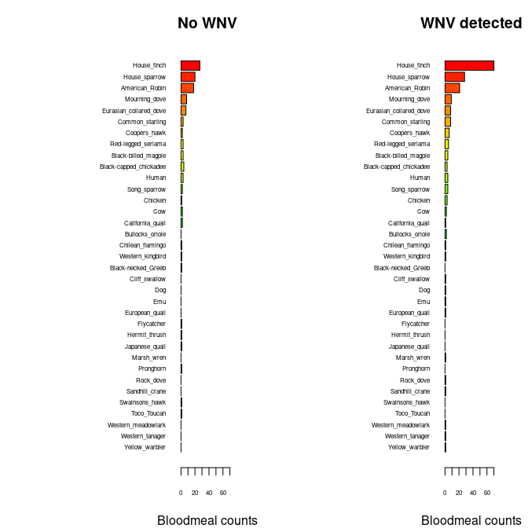
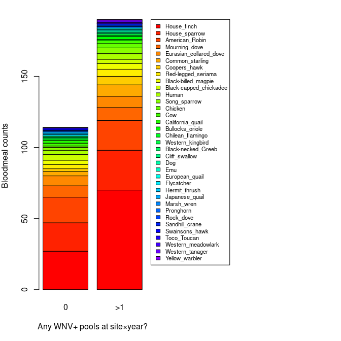
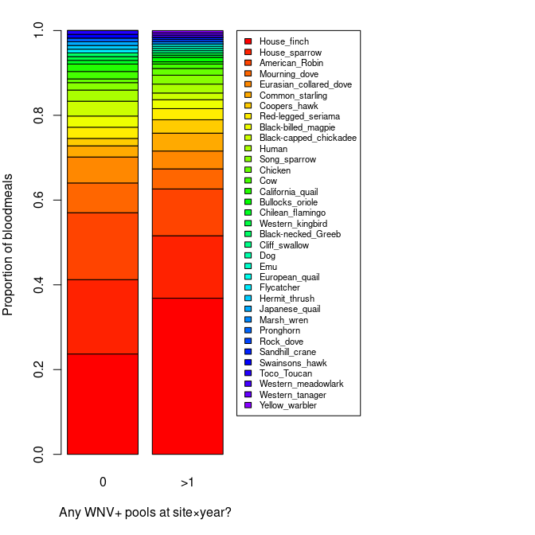

Wk3 - Bloodmeal Dataset
================
Norah Saarman
Sep 9, 2025

- [Bloodmeal COi Sequences](#bloodmeal-coi-sequences)
- [WNV test status by mosquito pool](#wnv-test-status-by-mosquito-pool)
- [Overlap by loc_year +
  mosq_species](#overlap-by-loc_year--mosq_species)
  - [Taxonomy](#taxonomy)
- [Collapse to counts](#collapse-to-counts)
  - [Narrow format only one host_species
    column…](#narrow-format-only-one-host_species-column)
  - [Wide format counts](#wide-format-counts)
- [Barplots](#barplots)
  - [Horizontal plots](#horizontal-plots)
  - [Stacked plot](#stacked-plot)
- [GLM: Generalized Linear Modeling](#glm-generalized-linear-modeling)
  - [House finch GLM](#house-finch-glm)
  - [Song Sparrow GLM](#song-sparrow-glm)
- [NOTE: I would explore host/mosquito species in pool a little
  more…](#note-i-would-explore-hostmosquito-species-in-pool-a-little-more)

All data available, pip and tars Uniting WNV and Bloodmeal COi Sequences

# Bloodmeal COi Sequences

``` r
blood_raw <- read.csv("./data/bloodmeal_for_BIOL3070.csv", stringsAsFactors = FALSE)

blood <- data.frame(
  date           = as.Date(blood_raw$Collection.Date, 
                           tryFormats = c("%Y-%m-%d","%m/%d/%Y")),
  year           = blood_raw$year,
  month          = blood_raw$month,
  lat            = blood_raw$Lat,
  long           = blood_raw$Long,
  loc_name       = blood_raw$Location,
  loc_code       = blood_raw$site_code,
  loc_year = sub("\\..*$", "", blood_raw$loc_year_month),
  mosq_species   = blood_raw$mosq_species,
  host_species   = blood_raw$host_species,
  host_common   = blood_raw$host_common,
  host_method   = blood_raw$host_method,
  BIOL3070_seqID = blood_raw$SEQ..BIOL3070
)

# Drop Cx_erythrothorax
blood <- subset(blood, mosq_species != "Cx_erythrothorax")

head(blood)
```

    ##       date year month      lat      long        loc_name loc_code     loc_year
    ## 1 21-08-11 2021     8 40.75233 -111.9184  Fire Station 6      231 site231_2021
    ## 2 20-05-26 2020     5 40.74805 -111.9679            Keto       60 site060_2020
    ## 3 20-05-26 2020     5 40.74805 -111.9679            Keto       60 site060_2020
    ## 4 18-07-05 2018     7 40.77633 -111.8990  Fire Station 2      214 site214_2018
    ## 5 18-07-30 2018     7 40.72365 -111.8227 Fire Station 13      218 site218_2018
    ## 6 18-06-27 2018     6 40.74222 -111.8755    Tracy Aviary      207 site207_2018
    ##    mosq_species             host_species      host_common     host_method
    ## 1 Cx_pipiens_sl        Passer_domesticus    House_sparrow          SPAdes
    ## 2 Cx_pipiens_sl         Sturnus_vulgaris  Common_starling          Sanger
    ## 3 Cx_pipiens_sl       Turdus_migratorius   American_Robin NPS.BWAmem.2024
    ## 4 Cx_pipiens_sl        Passer_domesticus    House_sparrow          SPAdes
    ## 5 Cx_pipiens_sl       Turdus_migratorius   American_Robin          SPAdes
    ## 6 Cx_pipiens_sl Phoenicopterus_chilensis Chilean_flamingo          SPAdes
    ##   BIOL3070_seqID
    ## 1          SQ001
    ## 2               
    ## 3               
    ## 4          SQ002
    ## 5          SQ003
    ## 6          SQ004

# WNV test status by mosquito pool

``` r
pools_raw <- read.csv("./data/mosquito_pools_WNV.csv", stringsAsFactors = FALSE)

pools <- data.frame(
  agency_pool_num = pools_raw$agency_pool_num,
  mosq_species    = pools_raw$mosq_species,
  num_count       = pools_raw$num_count,
  date            = as.Date(pools_raw$collection_date, 
                            tryFormats = c("%Y-%m-%d","%m/%d/%Y")),
  year            = pools_raw$year,
  month           = pools_raw$month,
  lat             = pools_raw$longitude,
  long            = pools_raw$latitude,
  loc_code        = pools_raw$site_code,
  loc_name        = pools_raw$site_name,
  loc_year = sub("\\..*$", "", pools_raw$loc_year_month),
  test_status     = pools_raw$test_status
)

# Drop Cx_erythrothorax
pools <- subset(pools, mosq_species != "Cx_erythrothorax")

head(pools)
```

    ##   agency_pool_num  mosq_species num_count       date year month      lat
    ## 1             147   Cx_tarsalis       100 2019-08-05 2019     8 -111.944
    ## 2             539   Cx_tarsalis        79 2019-07-29 2019     7 -111.944
    ## 3             846 Cx_pipiens_sl       100 2019-08-26 2019     8 -111.944
    ## 4             919 Cx_pipiens_sl       100 2019-09-03 2019     9 -111.944
    ## 5             920 Cx_pipiens_sl        93 2019-09-03 2019     9 -111.944
    ## 6            1012 Cx_pipiens_sl       100 2019-09-09 2019     9 -111.944
    ##       long loc_code loc_name     loc_year test_status
    ## 1 40.82646       29      ATV site029_2019   Confirmed
    ## 2 40.82646       29      ATV site029_2019   Confirmed
    ## 3 40.82646       29      ATV site029_2019   Confirmed
    ## 4 40.82646       29      ATV site029_2019   Confirmed
    ## 5 40.82646       29      ATV site029_2019   Confirmed
    ## 6 40.82646       29      ATV site029_2019   Confirmed

# Overlap by loc_year + mosq_species

``` r
# Inner join by loc_year + mosq_species
overlap <- merge(
  blood,
  pools,
  by = c("loc_year", "mosq_species")
)

head(overlap); str(overlap); nrow(overlap)
```

    ##       loc_year  mosq_species   date.x year.x month.x    lat.x    long.x
    ## 1 site001_2020 Cx_pipiens_sl 20-06-03   2020       6 40.81567 -111.9423
    ## 2 site001_2020 Cx_pipiens_sl 20-06-03   2020       6 40.81567 -111.9423
    ## 3 site001_2020 Cx_pipiens_sl 20-06-03   2020       6 40.81567 -111.9423
    ## 4 site001_2020 Cx_pipiens_sl 20-06-03   2020       6 40.81567 -111.9423
    ## 5 site001_2020 Cx_pipiens_sl 20-06-03   2020       6 40.81567 -111.9423
    ## 6 site001_2020 Cx_pipiens_sl 20-06-03   2020       6 40.81567 -111.9423
    ##   loc_name.x loc_code.x  host_species         host_common host_method
    ## 1 RAC Soccer          1 Pica_hudsonia Black-billed_magpie      SPAdes
    ## 2 RAC Soccer          1 Pica_hudsonia Black-billed_magpie      SPAdes
    ## 3 RAC Soccer          1 Pica_hudsonia Black-billed_magpie      SPAdes
    ## 4 RAC Soccer          1 Pica_hudsonia Black-billed_magpie      SPAdes
    ## 5 RAC Soccer          1 Pica_hudsonia Black-billed_magpie      SPAdes
    ## 6 RAC Soccer          1 Pica_hudsonia Black-billed_magpie      SPAdes
    ##   BIOL3070_seqID agency_pool_num num_count     date.y year.y month.y     lat.y
    ## 1          SQ094             816        40 2020-08-25   2020       8 -111.9423
    ## 2          SQ094             727        36 2020-08-18   2020       8 -111.9423
    ## 3          SQ094            1079        71 2020-09-24   2020       9 -111.9423
    ## 4          SQ094             979        22 2020-09-11   2020       9 -111.9423
    ## 5          SQ094             491        30 2020-08-03   2020       8 -111.9423
    ## 6          SQ094            1002        43 2020-09-15   2020       9 -111.9423
    ##     long.y loc_code.y loc_name.y test_status
    ## 1 40.81567          1 RAC Soccer    Negative
    ## 2 40.81567          1 RAC Soccer    Negative
    ## 3 40.81567          1 RAC Soccer    Negative
    ## 4 40.81567          1 RAC Soccer    Negative
    ## 5 40.81567          1 RAC Soccer    Negative
    ## 6 40.81567          1 RAC Soccer    Negative

    ## 'data.frame':    4144 obs. of  23 variables:
    ##  $ loc_year       : chr  "site001_2020" "site001_2020" "site001_2020" "site001_2020" ...
    ##  $ mosq_species   : chr  "Cx_pipiens_sl" "Cx_pipiens_sl" "Cx_pipiens_sl" "Cx_pipiens_sl" ...
    ##  $ date.x         : Date, format: "20-06-03" "20-06-03" ...
    ##  $ year.x         : int  2020 2020 2020 2020 2020 2020 2020 2020 2020 2020 ...
    ##  $ month.x        : int  6 6 6 6 6 6 6 6 6 6 ...
    ##  $ lat.x          : num  40.8 40.8 40.8 40.8 40.8 ...
    ##  $ long.x         : num  -112 -112 -112 -112 -112 ...
    ##  $ loc_name.x     : chr  "RAC Soccer" "RAC Soccer" "RAC Soccer" "RAC Soccer" ...
    ##  $ loc_code.x     : int  1 1 1 1 1 1 1 1 1 1 ...
    ##  $ host_species   : chr  "Pica_hudsonia" "Pica_hudsonia" "Pica_hudsonia" "Pica_hudsonia" ...
    ##  $ host_common    : chr  "Black-billed_magpie" "Black-billed_magpie" "Black-billed_magpie" "Black-billed_magpie" ...
    ##  $ host_method    : chr  "SPAdes" "SPAdes" "SPAdes" "SPAdes" ...
    ##  $ BIOL3070_seqID : chr  "SQ094" "SQ094" "SQ094" "SQ094" ...
    ##  $ agency_pool_num: int  816 727 1079 979 491 1002 1067 951 259 627 ...
    ##  $ num_count      : int  40 36 71 22 30 43 53 73 58 36 ...
    ##  $ date.y         : Date, format: "2020-08-25" "2020-08-18" ...
    ##  $ year.y         : int  2020 2020 2020 2020 2020 2020 2020 2020 2020 2020 ...
    ##  $ month.y        : int  8 8 9 9 8 9 9 9 7 8 ...
    ##  $ lat.y          : num  -112 -112 -112 -112 -112 ...
    ##  $ long.y         : num  40.8 40.8 40.8 40.8 40.8 ...
    ##  $ loc_code.y     : int  1 1 1 1 1 1 1 1 1 1 ...
    ##  $ loc_name.y     : chr  "RAC Soccer" "RAC Soccer" "RAC Soccer" "RAC Soccer" ...
    ##  $ test_status    : chr  "Negative" "Negative" "Negative" "Negative" ...

    ## [1] 4144

## Taxonomy

``` r
# Add taxonomy to table
library(taxize)
overlap$species <- gsub("_", " ", overlap$host_species)
species_names <- unique(overlap$species)

get_tax <- function(sp) {
  x <- try(classification(sp, db = "gbif")[[1]], silent = TRUE)
  if (inherits(x, "try-error") || is.null(x)) return(NULL)
  x$rank <- tolower(x$rank)
  pick <- function(rk) {
    v <- x$name[x$rank == rk]
    if (length(v) > 0) v[1] else NA
  }
  data.frame(
    species = sp,
    genus   = pick("genus"),
    family  = pick("family"),
    order   = pick("order"),
    class   = pick("class"),
    stringsAsFactors = FALSE
  )
}

tax_table <- do.call(rbind, lapply(species_names, get_tax))
```

    ## ══  1 queries  ═══════════════

    ## 
    ## Retrieving data for taxon 'Pica hudsonia'

    ## ✔  Found:  Pica hudsonia
    ## ══  Results  ═════════════════
    ## 
    ## • Total: 1 
    ## • Found: 1 
    ## • Not Found: 0
    ## ══  1 queries  ═══════════════

    ## 
    ## Retrieving data for taxon 'Turdus migratorius'

    ## ✔  Found:  Turdus migratorius
    ## ══  Results  ═════════════════
    ## 
    ## • Total: 1 
    ## • Found: 1 
    ## • Not Found: 0
    ## ══  1 queries  ═══════════════

    ## 
    ## Retrieving data for taxon 'Haemorhous mexicanus'

    ## ✔  Found:  Haemorhous mexicanus
    ## ══  Results  ═════════════════
    ## 
    ## • Total: 1 
    ## • Found: 1 
    ## • Not Found: 0
    ## ══  1 queries  ═══════════════

    ## 
    ## Retrieving data for taxon 'Poecile atricapillus'

    ## ✔  Found:  Poecile atricapillus
    ## ══  Results  ═════════════════
    ## 
    ## • Total: 1 
    ## • Found: 1 
    ## • Not Found: 0
    ## ══  1 queries  ═══════════════

    ## 
    ## Retrieving data for taxon 'Bos taurus'

    ## ✔  Found:  Bos taurus
    ## ══  Results  ═════════════════
    ## 
    ## • Total: 1 
    ## • Found: 1 
    ## • Not Found: 0
    ## ══  1 queries  ═══════════════

    ## 
    ## Retrieving data for taxon 'Buteo swainsoni'

    ## ✔  Found:  Buteo swainsoni
    ## ══  Results  ═════════════════
    ## 
    ## • Total: 1 
    ## • Found: 1 
    ## • Not Found: 0
    ## ══  1 queries  ═══════════════

    ## 
    ## Retrieving data for taxon 'Podiceps nigricollis'

    ## ✔  Found:  Podiceps nigricollis
    ## ══  Results  ═════════════════
    ## 
    ## • Total: 1 
    ## • Found: 1 
    ## • Not Found: 0
    ## ══  1 queries  ═══════════════

    ## 
    ## Retrieving data for taxon 'Gallus gallus'

    ## ✔  Found:  Gallus gallus
    ## ══  Results  ═════════════════
    ## 
    ## • Total: 1 
    ## • Found: 1 
    ## • Not Found: 0
    ## ══  1 queries  ═══════════════

    ## 
    ## Retrieving data for taxon 'Antilocapra americana'

    ## ✔  Found:  Antilocapra americana
    ## ══  Results  ═════════════════
    ## 
    ## • Total: 1 
    ## • Found: 1 
    ## • Not Found: 0
    ## ══  1 queries  ═══════════════

    ## 
    ## Retrieving data for taxon 'Zenaida macroura'

    ## ✔  Found:  Zenaida macroura
    ## ══  Results  ═════════════════
    ## 
    ## • Total: 1 
    ## • Found: 1 
    ## • Not Found: 0
    ## ══  1 queries  ═══════════════

    ## 
    ## Retrieving data for taxon 'Passer domesticus'

    ## ✔  Found:  Passer domesticus
    ## ══  Results  ═════════════════
    ## 
    ## • Total: 1 
    ## • Found: 1 
    ## • Not Found: 0
    ## ══  1 queries  ═══════════════

    ## 
    ## Retrieving data for taxon 'Streptopelia decaocto'

    ## ✔  Found:  Streptopelia decaocto
    ## ══  Results  ═════════════════
    ## 
    ## • Total: 1 
    ## • Found: 1 
    ## • Not Found: 0
    ## ══  1 queries  ═══════════════

    ## 
    ## Retrieving data for taxon 'Tyrannus verticalis'

    ## ✔  Found:  Tyrannus verticalis
    ## ══  Results  ═════════════════
    ## 
    ## • Total: 1 
    ## • Found: 1 
    ## • Not Found: 0
    ## ══  1 queries  ═══════════════

    ## 
    ## Retrieving data for taxon 'Homo sapiens'

    ## ✔  Found:  Homo sapiens
    ## ══  Results  ═════════════════
    ## 
    ## • Total: 1 
    ## • Found: 1 
    ## • Not Found: 0
    ## ══  1 queries  ═══════════════

    ## 
    ## Retrieving data for taxon 'Sturnus vulgaris'

    ## ✔  Found:  Sturnus vulgaris
    ## ══  Results  ═════════════════
    ## 
    ## • Total: 1 
    ## • Found: 1 
    ## • Not Found: 0
    ## ══  1 queries  ═══════════════

    ## 
    ## Retrieving data for taxon 'Icterus bullockii'

    ## ✔  Found:  Icterus bullockii
    ## ══  Results  ═════════════════
    ## 
    ## • Total: 1 
    ## • Found: 1 
    ## • Not Found: 0
    ## ══  1 queries  ═══════════════

    ## 
    ## Retrieving data for taxon 'Cistothorus palustris'

    ## ✔  Found:  Cistothorus palustris
    ## ══  Results  ═════════════════
    ## 
    ## • Total: 1 
    ## • Found: 1 
    ## • Not Found: 0
    ## ══  1 queries  ═══════════════

    ## 
    ## Retrieving data for taxon 'Cariama cristata'

    ## ✔  Found:  Cariama cristata
    ## ══  Results  ═════════════════
    ## 
    ## • Total: 1 
    ## • Found: 1 
    ## • Not Found: 0
    ## ══  1 queries  ═══════════════

    ## 
    ## Retrieving data for taxon 'Phoenicopterus chilensis'

    ## ✔  Found:  Phoenicopterus chilensis
    ## ══  Results  ═════════════════
    ## 
    ## • Total: 1 
    ## • Found: 1 
    ## • Not Found: 0
    ## ══  1 queries  ═══════════════

    ## 
    ## Retrieving data for taxon 'Dromaius novaehollandiae'

    ## ✔  Found:  Dromaius novaehollandiae
    ## ══  Results  ═════════════════
    ## 
    ## • Total: 1 
    ## • Found: 1 
    ## • Not Found: 0
    ## ══  1 queries  ═══════════════

    ## 
    ## Retrieving data for taxon 'Antigone canadensis'

    ## ✔  Found:  Antigone canadensis
    ## ══  Results  ═════════════════
    ## 
    ## • Total: 1 
    ## • Found: 1 
    ## • Not Found: 0
    ## ══  1 queries  ═══════════════

    ## 
    ## Retrieving data for taxon 'Callipepla californica'

    ## ✔  Found:  Callipepla californica
    ## ══  Results  ═════════════════
    ## 
    ## • Total: 1 
    ## • Found: 1 
    ## • Not Found: 0
    ## ══  1 queries  ═══════════════

    ## 
    ## Retrieving data for taxon 'Tyrannus forficatus'

    ## ✔  Found:  Tyrannus forficatus
    ## ══  Results  ═════════════════
    ## 
    ## • Total: 1 
    ## • Found: 1 
    ## • Not Found: 0
    ## ══  1 queries  ═══════════════

    ## 
    ## Retrieving data for taxon 'Coturnix coturnix'

    ## ✔  Found:  Coturnix coturnix
    ## ══  Results  ═════════════════
    ## 
    ## • Total: 1 
    ## • Found: 1 
    ## • Not Found: 0
    ## ══  1 queries  ═══════════════

    ## 
    ## Retrieving data for taxon 'Accipiter cooperii'

    ## ✔  Found:  Accipiter cooperii
    ## ══  Results  ═════════════════
    ## 
    ## • Total: 1 
    ## • Found: 1 
    ## • Not Found: 0
    ## ══  1 queries  ═══════════════

    ## 
    ## Retrieving data for taxon 'Setophaga petechia'

    ## ✔  Found:  Setophaga petechia
    ## ══  Results  ═════════════════
    ## 
    ## • Total: 1 
    ## • Found: 1 
    ## • Not Found: 0
    ## ══  1 queries  ═══════════════

    ## 
    ## Retrieving data for taxon 'Petrochelidon pyrrhonota'

    ## ✔  Found:  Petrochelidon pyrrhonota
    ## ══  Results  ═════════════════
    ## 
    ## • Total: 1 
    ## • Found: 1 
    ## • Not Found: 0
    ## ══  1 queries  ═══════════════

    ## 
    ## Retrieving data for taxon 'Catharus guttatus'

    ## ✔  Found:  Catharus guttatus
    ## ══  Results  ═════════════════
    ## 
    ## • Total: 1 
    ## • Found: 1 
    ## • Not Found: 0
    ## ══  1 queries  ═══════════════

    ## 
    ## Retrieving data for taxon 'Melospiza melodia'

    ## ✔  Found:  Melospiza melodia
    ## ══  Results  ═════════════════
    ## 
    ## • Total: 1 
    ## • Found: 1 
    ## • Not Found: 0
    ## ══  1 queries  ═══════════════

    ## 
    ## Retrieving data for taxon 'Ramphastos toco'

    ## ✔  Found:  Ramphastos toco
    ## ══  Results  ═════════════════
    ## 
    ## • Total: 1 
    ## • Found: 1 
    ## • Not Found: 0
    ## ══  1 queries  ═══════════════

    ## 
    ## Retrieving data for taxon 'Canis lupus'

    ## ✔  Found:  Canis lupus
    ## ══  Results  ═════════════════
    ## 
    ## • Total: 1 
    ## • Found: 1 
    ## • Not Found: 0
    ## ══  1 queries  ═══════════════

    ## 
    ## Retrieving data for taxon 'Columba livia'

    ## ✔  Found:  Columba livia
    ## ══  Results  ═════════════════
    ## 
    ## • Total: 1 
    ## • Found: 1 
    ## • Not Found: 0
    ## ══  1 queries  ═══════════════

    ## 
    ## Retrieving data for taxon 'Sturnella neglecta'

    ## ✔  Found:  Sturnella neglecta
    ## ══  Results  ═════════════════
    ## 
    ## • Total: 1 
    ## • Found: 1 
    ## • Not Found: 0
    ## ══  1 queries  ═══════════════

    ## 
    ## Retrieving data for taxon 'Coturnix japonica'

    ## ✔  Found:  Coturnix japonica
    ## ══  Results  ═════════════════
    ## 
    ## • Total: 1 
    ## • Found: 1 
    ## • Not Found: 0
    ## ══  1 queries  ═══════════════

    ## 
    ## Retrieving data for taxon 'Piranga ludoviciana'

    ## ✔  Found:  Piranga ludoviciana
    ## ══  Results  ═════════════════
    ## 
    ## • Total: 1 
    ## • Found: 1 
    ## • Not Found: 0

``` r
# join back to overlap
overlap <- merge(overlap, tax_table, by = "species", all.x = TRUE)
head(overlap[c("host_species","species","genus","family","order","class")])
```

    ##         host_species            species     genus       family           order
    ## 1 Accipiter_cooperii Accipiter cooperii Accipiter Accipitridae Accipitriformes
    ## 2 Accipiter_cooperii Accipiter cooperii Accipiter Accipitridae Accipitriformes
    ## 3 Accipiter_cooperii Accipiter cooperii Accipiter Accipitridae Accipitriformes
    ## 4 Accipiter_cooperii Accipiter cooperii Accipiter Accipitridae Accipitriformes
    ## 5 Accipiter_cooperii Accipiter cooperii Accipiter Accipitridae Accipitriformes
    ## 6 Accipiter_cooperii Accipiter cooperii Accipiter Accipitridae Accipitriformes
    ##   class
    ## 1  Aves
    ## 2  Aves
    ## 3  Aves
    ## 4  Aves
    ## 5  Aves
    ## 6  Aves

``` r
# Write to file
write.csv(overlap, "./data/overlap_bloodmeal_WNV_byYear_pip_tar.csv", row.names = FALSE)
```

# Collapse to counts

Host species, and counts of confirmed/negative WNV pools by loc_year ×
mosq_species.

## Narrow format only one host_species column…

``` r
## 1) Bloodmeal counts: host species per key
host_counts <- aggregate(
  x = list(n_bloodmeals = rep(1, nrow(blood))),
  by = list(
    loc_year = blood$loc_year,
    mosq_species   = blood$mosq_species,
    host_common   = blood$host_common
  ),
  FUN = sum
)

## 2) WNV pool counts: test status per key
pool_counts_long <- aggregate(
  x = list(n_pools = rep(1, nrow(pools))),
  by = list(
    loc_year = pools$loc_year,
    mosq_species   = pools$mosq_species,
    test_status    = pools$test_status
  ),
  FUN = sum
)

## 3) Make Confirmed/Negative columns (keep both; fill missing with 0)
pc_conf <- subset(pool_counts_long, test_status == "Confirmed")[, c("loc_year","mosq_species","n_pools")]
names(pc_conf)[3] <- "pools_confirmed"

pc_neg  <- subset(pool_counts_long, test_status == "Negative")[, c("loc_year","mosq_species","n_pools")]
names(pc_neg)[3] <- "pools_negative"

pool_counts_wide <- merge(pc_conf, pc_neg, by = c("loc_year","mosq_species"), all = TRUE)
pool_counts_wide$pools_confirmed[is.na(pool_counts_wide$pools_confirmed)] <- 0
pool_counts_wide$pools_negative[is.na(pool_counts_wide$pools_negative)]   <- 0

## 4) Join: host × (confirmed/negative) per key; keep ALL host_species
counts <- merge(
  host_counts,
  pool_counts_wide,
  by = c("loc_year","mosq_species"),
  all.x = TRUE
)

## replace NAs for pool counts with 0 (keys with blood meals but no pools)
counts$pools_confirmed[is.na(counts$pools_confirmed)] <- 0
counts$pools_negative[is.na(counts$pools_negative)]   <- 0

## check
head(counts)
```

    ##       loc_year  mosq_species            host_common n_bloodmeals
    ## 1 site001_2020 Cx_pipiens_sl    Black-billed_magpie            1
    ## 2 site001_2020 Cx_pipiens_sl            House_finch            1
    ## 3 site001_2020 Cx_pipiens_sl         American_Robin            2
    ## 4 site001_2021 Cx_pipiens_sl         American_Robin            1
    ## 5 site005_2020 Cx_pipiens_sl Black-capped_chickadee            1
    ## 6 site005_2020 Cx_pipiens_sl            House_finch            1
    ##   pools_confirmed pools_negative
    ## 1               0             10
    ## 2               0             10
    ## 3               0             10
    ## 4               6             11
    ## 5               0              8
    ## 6               0              8

``` r
sum(counts$n_bloodmeals)  
```

    ## [1] 304

## Wide format counts

For CCA (or RDA, PERMANOVA, etc.) you want the host species as separate
columns, one per species, with counts filled in (0 if absent). That way
you have a site × time × mosquito species matrix of bird hosts.

``` r
## 1) Bloodmeal counts: wide by host species
host_counts <- aggregate(
  x = list(n_bloodmeals = rep(1, nrow(blood))),
  by = list(
    loc_year = blood$loc_year,
    mosq_species   = blood$mosq_species,
    host_common   = blood$host_common
  ),
  FUN = sum
)

## reshape wide: each host_species becomes its own column
host_counts_wide <- reshape(
  host_counts,
  idvar   = c("loc_year","mosq_species"),
  timevar = "host_common",
  direction = "wide"
)

## clean names: host_species -> host_xxx
names(host_counts_wide) <- sub("^n_bloodmeals\\.", "host_", names(host_counts_wide))

## replace NAs with 0 (no samples of that host at that site/month/species)
host_counts_wide[is.na(host_counts_wide)] <- 0

## 2) Pool counts: confirmed/negative (same as before)
pool_counts_long <- aggregate(
  x = list(n_pools = rep(1, nrow(pools))),
  by = list(
    loc_year = pools$loc_year,
    mosq_species   = pools$mosq_species,
    test_status    = pools$test_status
  ),
  FUN = sum
)

pc_conf <- subset(pool_counts_long, test_status == "Confirmed")[, c("loc_year","mosq_species","n_pools")]
names(pc_conf)[3] <- "pools_confirmed"

pc_neg <- subset(pool_counts_long, test_status == "Negative")[, c("loc_year","mosq_species","n_pools")]
names(pc_neg)[3] <- "pools_negative"

pool_counts_wide <- merge(pc_conf, pc_neg, by = c("loc_year","mosq_species"), all = TRUE)
pool_counts_wide$pools_confirmed[is.na(pool_counts_wide$pools_confirmed)] <- 0
pool_counts_wide$pools_negative[is.na(pool_counts_wide$pools_negative)]   <- 0

## 3) Final join: host × pools
counts_matrix <- merge(
  host_counts_wide,
  pool_counts_wide,
  by = c("loc_year","mosq_species"),
  all = TRUE
)

## replace NAs with 0 after join
counts_matrix[is.na(counts_matrix)] <- 0

# Did I loose any host data?
# Identify host columns (everything starting with "host_")
host_cols <- grep("^host_", names(counts_matrix))

# Sum all host counts across the matrix
sum(counts_matrix[ , host_cols])
```

    ## [1] 304

``` r
# add a column for location specific positives:
# Compute whether any positives occurred at each site×year
loc_pos <- aggregate(
  pools_confirmed ~ loc_year,
  counts_matrix,
  function(x) as.integer(sum(x) > 0)
)
names(loc_pos)[2] <- "loc_positives"

# Join back into your main matrix
counts_matrix <- merge(counts_matrix, loc_pos, by = "loc_year", all.x = TRUE)

# Quick check
table(counts_matrix$loc_positives)  # 0 = no positives that year; 1 = at least one positive
```

    ## 
    ##   0   1 
    ## 207 188

``` r
## Save
out_file <- "./data/overlap_bloodmeal_WNV_counts_byYear_pip_tar.csv"
write.csv(counts_matrix, out_file, row.names = FALSE)
```

# Barplots

## Horizontal plots

``` r
## --- 0) Inputs assumed ---
## counts_matrix: data.frame with column 'loc_positives' (0/1) and host columns 'host_*'

## 1) Identify host columns
host_cols <- grep("^host_", names(counts_matrix), value = TRUE)

if (length(host_cols) == 0) {
  stop("No columns matching '^host_' were found in counts_matrix.")
}

## 2) Ensure loc_positives is present and has both levels 0 and 1 where possible
counts_matrix$loc_positives <- factor(counts_matrix$loc_positives, levels = c(0, 1))

## 3) Aggregate host counts by loc_positives
agg <- stats::aggregate(
  counts_matrix[, host_cols, drop = FALSE],
  by = list(loc_positives = counts_matrix$loc_positives),
  FUN = function(x) sum(as.numeric(x), na.rm = TRUE)
)

## make sure both rows exist; if one is missing, add a zero row
need_levels <- setdiff(levels(counts_matrix$loc_positives), as.character(agg$loc_positives))
if (length(need_levels)) {
  zero_row <- as.list(rep(0, length(host_cols)))
  names(zero_row) <- host_cols
  for (lv in need_levels) {
    agg <- rbind(agg, c(lv, zero_row))
  }
  ## restore proper type
  agg$loc_positives <- factor(agg$loc_positives, levels = c("0","1"))
  ## coerce numeric host cols (they may have become character after rbind)
  for (hc in host_cols) agg[[hc]] <- as.numeric(agg[[hc]])
  agg <- agg[order(agg$loc_positives), , drop = FALSE]
}

## 4) Decide species order (overall abundance, descending)
overall <- colSums(agg[, host_cols, drop = FALSE], na.rm = TRUE)
host_order <- names(sort(overall, decreasing = TRUE))
species_labels <- rev(sub("^host_", "", host_order))  # nicer labels

## 5) Build count vectors for each panel in the SAME order
counts0 <- rev(as.numeric(agg[agg$loc_positives == 0, host_order, drop = TRUE]))
counts1 <- rev(as.numeric(agg[agg$loc_positives == 1, host_order, drop = TRUE]))

## 6) Colors: reuse your existing 'cols' if it exists and is long enough; otherwise generate
if (exists("cols") && length(cols) >= length(host_order)) {
  species_colors <- setNames(cols[seq_along(host_order)], species_labels)
} else {
  species_colors <- setNames(rainbow(length(host_order) + 10)[seq_along(host_order)], species_labels)
}

## 7) Shared x-limit for comparability
xmax <- max(c(counts0, counts1), na.rm = TRUE)
xmax <- if (is.finite(xmax)) xmax else 1
xlim_use <- c(0, xmax * 1.08)

## 8) Plot: two horizontal barplots with identical order and colors
op <- par(mfrow = c(1, 2),
          mar = c(4, 12, 3, 2),  # big left margin for species names
          xaxs = "i")           # a bit tighter axis padding

## Panel A: No WNV detected (loc_positives = 0)
barplot(height = counts0,
        names.arg = species_labels, 
        cex.names = .5,
        cex.axis = .5,
        col = rev(unname(species_colors[species_labels])),
        horiz = TRUE,
        las = 1,
        xlab = "Bloodmeal counts",
        main = "No WNV",
        xlim = xlim_use)

## Panel B: WNV detected (loc_positives = 1)
barplot(height = counts1,
        names.arg = species_labels, 
        cex.names = .5,
        cex.axis = .5,
        col = rev(unname(species_colors[species_labels])),
        horiz = TRUE,
        las = 1,
        xlab = "Bloodmeal counts",
        main = "WNV detected",
        xlim = xlim_use)
```



``` r
par(op)

## (Optional) Keep the mapping for reuse elsewhere
host_species_colors <- species_colors
```

## Stacked plot

Stacked barplot of host composition by loc_positives (0 vs 1)

``` r
## 1) Identify host columns
host_cols <- grep("^host_", names(counts_matrix), value = TRUE)

## 2) Aggregate host counts by loc_positives (0/1)
agg <- aggregate(counts_matrix[, host_cols, drop = FALSE],
                 by = list(loc_positives = counts_matrix$loc_positives),
                 FUN = sum)

## ensure order is 0,1 if both exist
agg <- agg[order(agg$loc_positives), , drop = FALSE]

## 3) Order host columns by overall abundance for a nicer legend
totals <- colSums(agg[, host_cols, drop = FALSE])
host_order <- names(sort(totals, decreasing = TRUE))

## 4) Build matrices for plotting
mat_counts <- t(as.matrix(agg[, host_order, drop = FALSE]))  # rows=hosts, cols=loc_positives groups
colnames(mat_counts) <- paste0("loc_positives=", agg$loc_positives)

## 5) Colors and labels
n_hosts <- nrow(mat_counts)
cols <- rainbow(n_hosts+10)
leg_labs <- sub("^host_", "", rownames(mat_counts))  # cleaner legend labels

mat_counts
```

    ##                             loc_positives=0 loc_positives=1
    ## host_House_finch                         27              70
    ## host_House_sparrow                       20              28
    ## host_American_Robin                      18              21
    ## host_Mourning_dove                        8               9
    ## host_Eurasian_collared_dove               7               8
    ## host_Common_starling                      3               8
    ## host_Coopers_hawk                         2               6
    ## host_Red-legged_seriama                   3               5
    ## host_Black-billed_magpie                  3               4
    ## host_Black-capped_chickadee               4               3
    ## host_Human                                3               4
    ## host_Song_sparrow                         2               4
    ## host_Chicken                              1               3
    ## host_Cow                                  2               2
    ## host_California_quail                     2               1
    ## host_Bullocks_oriole                      0               2
    ## host_Chilean_flamingo                     1               1
    ## host_Western_kingbird                     1               1
    ## host_Black-necked_Greeb                   1               0
    ## host_Cliff_swallow                        0               1
    ## host_Dog                                  0               1
    ## host_Emu                                  0               1
    ## host_European_quail                       0               1
    ## host_Flycatcher                           1               0
    ## host_Hermit_thrush                        1               0
    ## host_Japanese_quail                       1               0
    ## host_Marsh_wren                           0               1
    ## host_Pronghorn                            1               0
    ## host_Rock_dove                            0               1
    ## host_Sandhill_crane                       0               1
    ## host_Swainsons_hawk                       1               0
    ## host_Toco_Toucan                          1               0
    ## host_Western_meadowlark                   0               1
    ## host_Western_tanager                      0               1
    ## host_Yellow_warbler                       0               1

``` r
## 6a) Stacked barplot — COUNTS
op <- par(mar = c(5, 4, 2, 20))  # extra right margin for legend
barplot(mat_counts, beside = FALSE, col = cols,
        names.arg = c("0",">1"),
        ylab = "Bloodmeal counts",
        xlab = "Any WNV+ pools at site×year?")
legend("topright", inset = c(-0.78, 0), xpd = TRUE,
       legend = leg_labs, fill = cols, cex = 0.7)
```



``` r
par(op)

## 6b) (Optional) Stacked barplot — PROPORTIONS
mat_props <- apply(mat_counts, 2, function(x) if (sum(x) > 0) x / sum(x) else x)
op <- par(mar = c(5, 4, 2, 20))
barplot(mat_props, beside = FALSE, col = cols,
        names.arg = c("0",">1"),
        ylab = "Proportion of bloodmeals",
        xlab = "Any WNV+ pools at site×year?")
legend("topright", inset = c(-0.78, 0), xpd = TRUE,
       legend = leg_labs, fill = cols, cex = 0.7)
```



``` r
par(op)
```

# GLM: Generalized Linear Modeling

## House finch GLM

Does house finch have an effect by location x year? YES.

``` r
#glm with bird
glm1 <- glm(loc_positives ~ host_House_finch,
            data = counts_matrix,
            family = binomial)
summary(glm1)
```

    ## 
    ## Call:
    ## glm(formula = loc_positives ~ host_House_finch, family = binomial, 
    ##     data = counts_matrix)
    ## 
    ## Coefficients:
    ##                  Estimate Std. Error z value Pr(>|z|)  
    ## (Intercept)       -0.1709     0.1053  -1.622   0.1047  
    ## host_House_finch   0.3468     0.1586   2.187   0.0287 *
    ## ---
    ## Signif. codes:  0 '***' 0.001 '**' 0.01 '*' 0.05 '.' 0.1 ' ' 1
    ## 
    ## (Dispersion parameter for binomial family taken to be 1)
    ## 
    ##     Null deviance: 546.67  on 394  degrees of freedom
    ## Residual deviance: 539.69  on 393  degrees of freedom
    ## AIC: 543.69
    ## 
    ## Number of Fisher Scoring iterations: 4

## Song Sparrow GLM

Does song sparrow have an effect? Not enough sample size.

``` r
#glm with bird
glm1 <- glm(loc_positives ~ host_Song_sparrow,
            data = counts_matrix,
            family = binomial)
summary(glm1)
```

    ## 
    ## Call:
    ## glm(formula = loc_positives ~ host_Song_sparrow, family = binomial, 
    ##     data = counts_matrix)
    ## 
    ## Coefficients:
    ##                   Estimate Std. Error z value Pr(>|z|)
    ## (Intercept)        -0.1023     0.1012  -1.011    0.312
    ## host_Song_sparrow   0.4120     0.6486   0.635    0.525
    ## 
    ## (Dispersion parameter for binomial family taken to be 1)
    ## 
    ##     Null deviance: 546.67  on 394  degrees of freedom
    ## Residual deviance: 546.22  on 393  degrees of freedom
    ## AIC: 550.22
    ## 
    ## Number of Fisher Scoring iterations: 3

# NOTE: I would explore host/mosquito species in pool a little more…

But… we can’t without more Cx. tarsalis bloodmeal data, because… Every
bloodmeal observation in overlap is being “tagged” with the species from
the pools at that site × year.

But the bloodmeal mosquito species may not actually be that species at
all — we’re borrowing the label from the pools.

Since we only have 11-ish Cx. tarsalis in the bloodmeal data, the restis
Cx. pipiens sl., maybe we should focus on the part of each datasetthat
is Cx. pipiens for any host effect.

TO improve sample size, maybe we should drop up a taxonomic level to
family/order.
