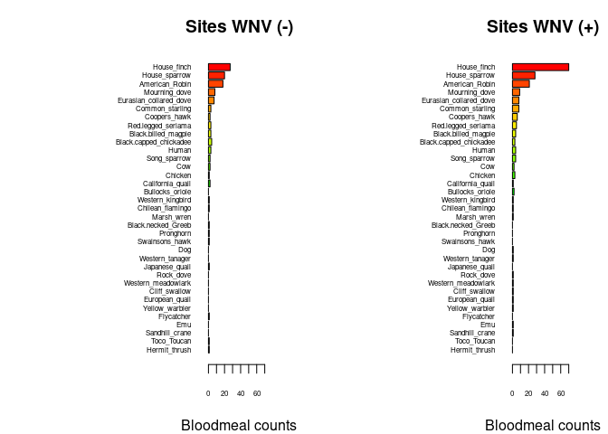
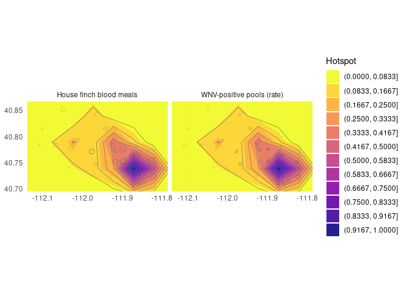

Wk5 - Mini-Report Code Chunks
================
Norah Saarman
Sep 25, 2025

- [Barplots of blood meal ID by trap locations with/without WNV positive
  mosquito
  pools](#barplots-of-blood-meal-id-by-trap-locations-withwithout-wnv-positive-mosquito-pools)
- [Generalized Linear Modeling (GLM)](#generalized-linear-modeling-glm)
- [OPTIONAL: Map of hotspots of house finches and WNV positive
  pools](#optional-map-of-hotspots-of-house-finches-and-wnv-positive-pools)

# Barplots of blood meal ID by trap locations with/without WNV positive mosquito pools

Horizontal plots:

``` r
## import counts_matrix: data.frame with column 'loc_positives' (0/1) and host columns 'host_*'
counts_matrix <- read.csv("./bloodmeal_plusWNV_for_BIOL3070.csv")

## 1) Identify host columns
host_cols <- grep("^host_", names(counts_matrix), value = TRUE)

if (length(host_cols) == 0) {
  stop("No columns matching '^host_' were found in counts_matrix.")
}

## 2) Ensure loc_positives is present and has both levels 0 and 1 where possible
counts_matrix$loc_positives <- factor(counts_matrix$loc_positives, levels = c(0, 1))

## 3) Aggregate host counts by loc_positives
agg <- stats::aggregate(
  counts_matrix[, host_cols, drop = FALSE],
  by = list(loc_positives = counts_matrix$loc_positives),
  FUN = function(x) sum(as.numeric(x), na.rm = TRUE)
)

## make sure both rows exist; if one is missing, add a zero row
need_levels <- setdiff(levels(counts_matrix$loc_positives), as.character(agg$loc_positives))
if (length(need_levels)) {
  zero_row <- as.list(rep(0, length(host_cols)))
  names(zero_row) <- host_cols
  for (lv in need_levels) {
    agg <- rbind(agg, c(lv, zero_row))
  }
  ## restore proper type
  agg$loc_positives <- factor(agg$loc_positives, levels = c("0","1"))
  ## coerce numeric host cols (they may have become character after rbind)
  for (hc in host_cols) agg[[hc]] <- as.numeric(agg[[hc]])
  agg <- agg[order(agg$loc_positives), , drop = FALSE]
}

## 4) Decide species order (overall abundance, descending)
overall <- colSums(agg[, host_cols, drop = FALSE], na.rm = TRUE)
host_order <- names(sort(overall, decreasing = TRUE))
species_labels <- rev(sub("^host_", "", host_order))  # nicer labels

## 5) Build count vectors for each panel in the SAME order
counts0 <- rev(as.numeric(agg[agg$loc_positives == 0, host_order, drop = TRUE]))
counts1 <- rev(as.numeric(agg[agg$loc_positives == 1, host_order, drop = TRUE]))

## 6) Colors: reuse your existing 'cols' if it exists and is long enough; otherwise generate
if (exists("cols") && length(cols) >= length(host_order)) {
  species_colors <- setNames(cols[seq_along(host_order)], species_labels)
} else {
  species_colors <- setNames(rainbow(length(host_order) + 10)[seq_along(host_order)], species_labels)
}

## 7) Shared x-limit for comparability
xmax <- max(c(counts0, counts1), na.rm = TRUE)
xmax <- if (is.finite(xmax)) xmax else 1
xlim_use <- c(0, xmax * 1.08)

## 8) Plot: two horizontal barplots with identical order and colors
op <- par(mfrow = c(1, 2),
          mar = c(4, 12, 3, 2),  # big left margin for species names
          xaxs = "i")           # a bit tighter axis padding

## Panel A: No WNV detected (loc_positives = 0)
barplot(height = counts0,
        names.arg = species_labels, 
        cex.names = .5,
        cex.axis = .5,
        col = rev(unname(species_colors[species_labels])),
        horiz = TRUE,
        las = 1,
        xlab = "Bloodmeal counts",
        main = "Sites WNV (-)",
        xlim = xlim_use)

## Panel B: WNV detected (loc_positives = 1)
barplot(height = counts1,
        names.arg = species_labels, 
        cex.names = .5,
        cex.axis = .5,
        col = rev(unname(species_colors[species_labels])),
        horiz = TRUE,
        las = 1,
        xlab = "Bloodmeal counts",
        main = "Sites WNV (+)",
        xlim = xlim_use)
```

<!-- -->

``` r
par(op)

## Keep the colors mapping for reuse elsewhere
host_species_colors <- species_colors
```

# Generalized Linear Modeling (GLM)

House finch GLM:

Is occurrence of house finch in blood meals associated with locations
WNV positivity rate in tested mosquito pools?

``` r
#glm: house-finch correlated with WNV positivity rate of pools?
glm2 <- glm(loc_rate ~ host_House_finch,
            data = counts_matrix)
summary(glm2)
```

    ## 
    ## Call:
    ## glm(formula = loc_rate ~ host_House_finch, data = counts_matrix)
    ## 
    ## Coefficients:
    ##                  Estimate Std. Error t value Pr(>|t|)    
    ## (Intercept)      0.054861   0.006755   8.122 6.07e-15 ***
    ## host_House_finch 0.027479   0.006662   4.125 4.54e-05 ***
    ## ---
    ## Signif. codes:  0 '***' 0.001 '**' 0.01 '*' 0.05 '.' 0.1 ' ' 1
    ## 
    ## (Dispersion parameter for gaussian family taken to be 0.01689032)
    ## 
    ##     Null deviance: 6.8915  on 392  degrees of freedom
    ## Residual deviance: 6.6041  on 391  degrees of freedom
    ##   (2 observations deleted due to missingness)
    ## AIC: -484.56
    ## 
    ## Number of Fisher Scoring iterations: 2

Answer: YES. Statistically significant association.

Possible caveats? Limitations?

# OPTIONAL: Map of hotspots of house finches and WNV positive pools

``` r
library(dplyr)
```

    ## 
    ## Attaching package: 'dplyr'

    ## The following objects are masked from 'package:stats':
    ## 
    ##     filter, lag

    ## The following objects are masked from 'package:base':
    ## 
    ##     intersect, setdiff, setequal, union

``` r
library(tidyr)
library(ggplot2)

hm <- counts_matrix %>%
  filter(!is.na(long), !is.na(lat)) %>%
  transmute(
    long, lat,
    `WNV-positive pools (rate)` = loc_rate,
    `House finch blood meals`   = host_House_finch
  ) %>%
  pivot_longer(-c(long, lat), names_to = "metric", values_to = "value") %>%
  mutate(value = ifelse(is.na(value), 0, value))

# plot extent (a small pad around data)
xpad <- diff(range(hm$long))*0.05
ypad <- diff(range(hm$lat))*0.05
xlim <- range(hm$long) + c(-xpad, xpad)
ylim <- range(hm$lat) + c(-ypad, ypad)

ggplot(hm, aes(long, lat)) +
  borders("state", regions = "utah", colour = "grey75", fill = NA) +
  # KDE hotspot, weighted by value
  stat_density_2d_filled(
    aes(weight = value, fill = after_stat(level)),
    contour_var = "ndensity", geom = "polygon",
    bins = 12, alpha = 0.9, adjust = 0.8
  ) +
  # optional faint contours
  stat_density_2d(
    aes(weight = value, color = after_stat(level)),
    contour_var = "ndensity", bins = 12, linewidth = 0.15, show.legend = FALSE
  ) +
  # show sites lightly on top
  geom_point(aes(size = pmax(value, 0.0001)), alpha = 0.5, shape = 21, stroke = 0.2,
             fill = NA, color = "grey30", show.legend = FALSE) +
  coord_quickmap(xlim = xlim, ylim = ylim) +
  facet_wrap(~ metric, nrow = 1) +
  scale_fill_viridis_d(option = "C", direction = -1, name = "Hotspot") +
  guides(color = "none") +
  theme_minimal() +
  labs(x = NULL, y = NULL)
```

<!-- -->
