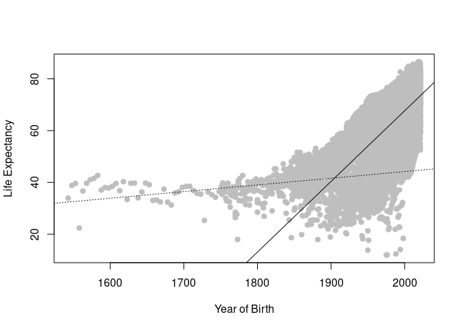

Linear Regression
================
Norah Saarman
2025-10-20

- [Loading the data](#loading-the-data)
  - [(Optional) Sneak Peak For
    Lecture](#optional-sneak-peak-for-lecture)
- [Linear regression: Before 1883, after
  1883](#linear-regression-before-1883-after-1883)
- [Scatterplot with line(s) of best
  fit](#scatterplot-with-lines-of-best-fit)
- [Homework Questions:](#homework-questions)
  - [Q1. How significant is the linear relationship between life
    expectancy and year of
    birth?](#q1-how-significant-is-the-linear-relationship-between-life-expectancy-and-year-of-birth)
  - [Q2. What is the slope of the linear regression line in each
    model?](#q2-what-is-the-slope-of-the-linear-regression-line-in-each-model)
  - [Q3. What might explain changes in the rate of increase in life
    expectancy through the years, especially before and after
    1883?](#q3-what-might-explain-changes-in-the-rate-of-increase-in-life-expectancy-through-the-years-especially-before-and-after-1883)

# Loading the data

``` r
# load data
life_expectancy <- readr::read_csv('https://raw.githubusercontent.com/rfordatascience/tidytuesday/main/data/2023/2023-12-05/life_expectancy.csv')
```

    ## Rows: 20755 Columns: 4
    ## ── Column specification ────────────────────────────────────────────────────────
    ## Delimiter: ","
    ## chr (2): Entity, Code
    ## dbl (2): Year, LifeExpectancy
    ## 
    ## ℹ Use `spec()` to retrieve the full column specification for this data.
    ## ℹ Specify the column types or set `show_col_types = FALSE` to quiet this message.

## (Optional) Sneak Peak For Lecture

``` r
# Scatterplot with line of best fit
plot(life_expectancy$Year[life_expectancy$Year > 1883],life_expectancy$LifeExpectancy[life_expectancy$Year > 1883], pch = 19, col = "grey", xlab = "Year of Birth", ylab = "Life Expectancy")
abline(lm(LifeExpectancy ~ Year, data = life_expectancy[life_expectancy$Year > 1883,]), lt = 1)
```

<!-- -->

# Linear regression: Before 1883, after 1883

In 1883, Koch identified and isolated the *Vibrio cholerae* bacterium in
pure culture, a discovery previously made by Filippo Pacini in 1854 but
not widely recognized. Koch’s findings provided the definitive
scientific proof needed to firmly establish the germ theory for cholera
and many other diseases and was the beginning of the modern medical era.

``` r
# Linear regression years before 1883 (Koch's germ theory)
lm_b1883 <- lm(LifeExpectancy ~ Year, data = life_expectancy[life_expectancy$Year < 1883,])
summary(lm_b1883)
```

    ## 
    ## Call:
    ## lm(formula = LifeExpectancy ~ Year, data = life_expectancy[life_expectancy$Year < 
    ##     1883, ])
    ## 
    ## Residuals:
    ##     Min      1Q  Median      3Q     Max 
    ## -23.204  -2.009   0.527   2.682  12.073 
    ## 
    ## Coefficients:
    ##              Estimate Std. Error t value Pr(>|t|)    
    ## (Intercept) -7.294260   5.899927  -1.236    0.217    
    ## Year         0.025738   0.003214   8.008 5.33e-15 ***
    ## ---
    ## Signif. codes:  0 '***' 0.001 '**' 0.01 '*' 0.05 '.' 0.1 ' ' 1
    ## 
    ## Residual standard error: 4.979 on 654 degrees of freedom
    ## Multiple R-squared:  0.08931,    Adjusted R-squared:  0.08791 
    ## F-statistic: 64.13 on 1 and 654 DF,  p-value: 5.329e-15

``` r
# Linear regression years after 1883 (Koch's germ theory)
lm_a1883 <- lm(LifeExpectancy ~ Year, data = life_expectancy[life_expectancy$Year > 1883,])
summary(lm_a1883)
```

    ## 
    ## Call:
    ## lm(formula = LifeExpectancy ~ Year, data = life_expectancy[life_expectancy$Year > 
    ##     1883, ])
    ## 
    ## Residuals:
    ##     Min      1Q  Median      3Q     Max 
    ## -52.007  -6.987   2.335   7.901  18.287 
    ## 
    ## Coefficients:
    ##               Estimate Std. Error t value Pr(>|t|)    
    ## (Intercept) -4.781e+02  5.201e+00  -91.93   <2e-16 ***
    ## Year         2.729e-01  2.626e-03  103.92   <2e-16 ***
    ## ---
    ## Signif. codes:  0 '***' 0.001 '**' 0.01 '*' 0.05 '.' 0.1 ' ' 1
    ## 
    ## Residual standard error: 10.05 on 20083 degrees of freedom
    ## Multiple R-squared:  0.3497, Adjusted R-squared:  0.3497 
    ## F-statistic: 1.08e+04 on 1 and 20083 DF,  p-value: < 2.2e-16

# Scatterplot with line(s) of best fit

``` r
plot(life_expectancy$Year,life_expectancy$LifeExpectancy, pch = 19, col = "grey", xlab = "Year of Birth", ylab = "Life Expectancy")
abline(lm_b1883, lt = 3)
abline(lm_a1883, lt = 1)
```

<!-- -->

# Homework Questions:

## Q1. How significant is the linear relationship between life expectancy and year of birth?

- What do the p-values in each model summary tell you about the
  statistical significance of the relationship?

- Compare across:

  1)  Before 1883

  2)  After 1883

*Hint: Look at the Pr(\>\|t\|) column for the Year variable in each
summary() output.*

## Q2. What is the slope of the linear regression line in each model?

- Report the estimated slope from the regression output (the coefficient
  for Year).

- Interpret it: How much does life expectancy change per year of birth?

- Compare across:

  1)  Before 1883

  2)  After 1883

*Hint: A higher slope means faster improvement in life expectancy.*

## Q3. What might explain changes in the rate of increase in life expectancy through the years, especially before and after 1883?

Possible real-world factors to consider:

- Improvements in medicine, public health, and sanitation.

- Major historical events (wars, pandemics).

- Industrialization and technological progress

You can also refer to insights from the [Our World in
Data](https://ourworldindata.org/life-expectancy?insight=life-expectancy-has-surpassed-predictions-again-and-again#key-insights)
article on the topic.
