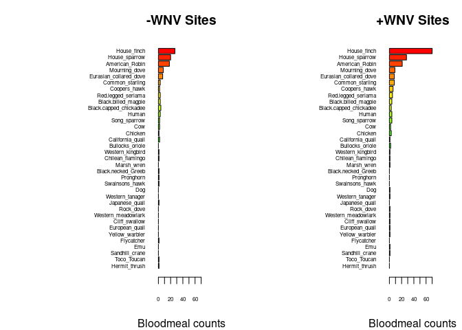
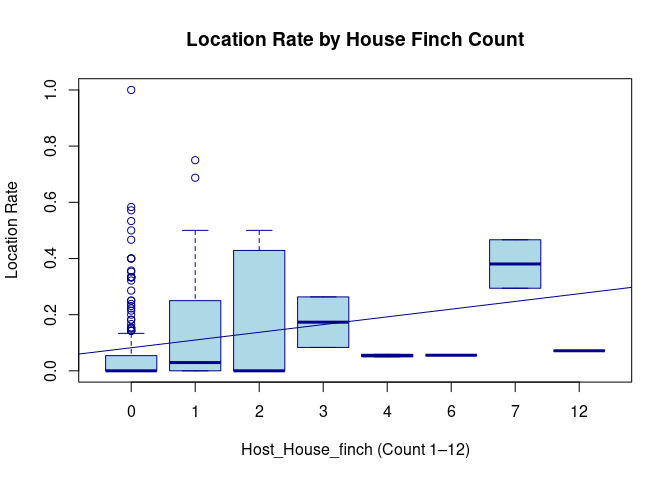
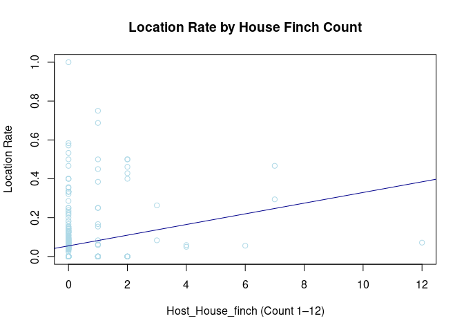

Warm-up mini-Report (Gold): Mosquito Blood Hosts in Salt Lake City, Utah
================
Norah Saarman
2025-11-04

- [ABSTRACT](#abstract)
- [BACKGROUND](#background)
- [STUDY QUESTION and HYPOTHESIS](#study-question-and-hypothesis)
  - [Question(s)](#questions)
  - [Hypothesis](#hypothesis)
  - [Prediction(s)](#predictions)
- [METHODS AND RESULTS](#methods-and-results)
  - [Analysis 1: Bar plots of host composition by WNV
    status](#analysis-1-bar-plots-of-host-composition-by-wnv-status)
  - [Analysis 2: Relationship between house finch blood meals and WNV
    positivity
    rate](#analysis-2-relationship-between-house-finch-blood-meals-and-wnv-positivity-rate)
  - [Optional Analysis 3: Spatial overlap of WNV and host
    hotspots](#optional-analysis-3-spatial-overlap-of-wnv-and-host-hotspots)
- [DISCUSSION](#discussion)
  - [Analysis 1: Host composition by WNV
    presence](#analysis-1-host-composition-by-wnv-presence)
  - [Analysis 2: Relationship between house finch blood meals and WNV
    positivity
    rate](#analysis-2-relationship-between-house-finch-blood-meals-and-wnv-positivity-rate-1)
  - [Optional Analysis 3: Spatial overlap of WNV and host
    hotspots](#optional-analysis-3-spatial-overlap-of-wnv-and-host-hotspots-1)
- [CONCLUSION](#conclusion)
- [REFERENCES](#references)

# ABSTRACT

West Nile virus (WNV) circulates in bird–mosquito cycles with occasional
human spillover. We asked whether house finch blood meals at
surveillance sites predict the rate of WNV-positive mosquito pools in
Salt Lake City. We summarized host composition by WNV presence with bar
plots and tested whether house finch counts predict WNV positivity rate
using a simple generalized linear model. Results are interpreted with
key limitations and next steps for targeted surveillance.

# BACKGROUND

West Nile virus (WNV) is an arbovirus transmitted primarily by Culex
mosquitoes, maintained through a bird–mosquito transmission cycle, and
occasionally infecting humans and other mammals as incidental hosts.
Understanding which bird species mosquitoes feed on helps identify
potential amplifying hosts—those that develop sufficient viremia to
transmit the virus back to mosquitoes.

Mosquito blood-meal analysis provides a direct link between vector and
host. After mosquitoes are collected in the field, the abdomen is
dissected and DNA is extracted from the blood meal. Host identity is
determined by PCR amplification of a mitochondrial marker (cytochrome
oxidase I) followed by MinION nanopore sequencing and comparison to a
reference database such as GenBank using BLASTN. These methods allow us
to connect mosquito host choice with virus prevalence in local mosquito
pools.

Previous studies (Komar et al. 2003) demonstrated that some bird
species, including house finches and American robins, maintain viremia
long enough to infect mosquitoes efficiently. Therefore, we hypothesize
that sites where mosquitoes have fed more frequently on these species
will also show higher rates of WNV-positive mosquito pools. Figure 1
illustrates the variation in viremia duration among North American birds
from Komar et al. (2003).

``` r
# Manually transcribe duration (mean, lo, hi) from the last table column
duration <- data.frame(
  Bird = c("Canada Goose","Mallard", 
           "American Kestrel","Northern Bobwhite",
           "Japanese Quail","Ring-necked Pheasant",
           "American Coot","Killdeer",
           "Ring-billed Gull","Mourning Dove",
           "Rock Dove","Monk Parakeet",
           "Budgerigar","Great Horned Owl",
           "Northern Flicker","Blue Jay",
           "Black-billed Magpie","American Crow",
           "Fish Crow","American Robin",
           "European Starling","Red-winged Blackbird",
           "Common Grackle","House Finch","House Sparrow"),
  mean = c(4.0,4.0,4.5,4.0,1.3,3.7,4.0,4.5,5.5,3.7,3.2,2.7,1.7,6.0,4.0,
           4.0,5.0,3.8,5.0,4.5,3.2,3.0,3.3,6.0,4.5),
  lo   = c(3,4,4,3,0,3,4,4,4,3,3,1,0,6,3,
           3,5,3,4,4,3,3,3,5,2),
  hi   = c(5,4,5,5,4,4,4,5,7,4,4,4,4,6,5,
           5,5,5,7,5,4,3,4,7,6)
)

# Choose some colors
cols <- c(rainbow(30)[c(10:29,1:5)])  # rainbow colors

# horizontal barplot
par(mar=c(5,12,2,2))  # wider left margin for names
bp <- barplot(duration$mean, horiz=TRUE, names.arg=duration$Bird,
              las=1, col=cols, xlab="Days of detectable viremia", xlim=c(0,7))

# add error bars
arrows(duration$lo, bp, duration$hi, bp,
       angle=90, code=3, length=0.05, col="black", xpd=TRUE)
```


# STUDY QUESTION and HYPOTHESIS

## Question(s)

Which bird species acts as an amplifying host of WNV in Salt Lake City?
Do house finch blood meals predict site-level WNV positivity?

## Hypothesis

House finches are acting as important amplifying hosts of WNV in Salt
Lake City.

## Prediction(s)

Sites with more house finch blood meals have higher WNV positivity
rates. Therefore, I predict that house finch blood-meal counts will be
positively associated with WNV-positive pool rate.

# METHODS AND RESULTS

We sequenced the vertebrate blood meals of Culex mosquitoes collected
from Salt Lake City to identify their avian hosts. PCR amplification
used vertebrate-universal primers targeting a 658-bp region of the
mitochondrial cytochrome oxidase I (COI) gene, and host identities were
confirmed by sequence comparison to GenBank. Using these results, we
summarized host blood-meal counts by whether a site had any WNV-positive
pools and compared host composition with paired horizontal bar plots. We
then tested whether house finch blood-meal counts predicted the
site-level WNV positivity rate using a linear model, and visualized
spatial hotspots for WNV positivity and house finch blood meals to
assess geographic overlap.

Results indicated that several bird species, including house finches and
American robins, appeared more frequently in WNV-positive sites than in
negative ones. Common urban birds such as sparrows and starlings
dominated overall, but their relative abundance was similar across site
types. The contrast in host composition suggests that mosquito feeding
preference or host availability may influence local WNV amplification.

## Analysis 1: Bar plots of host composition by WNV status

To evaluate whether host community composition differed between sites
with and without WNV detections, we summarized blood-meal counts for
each identified host species according to whether the site had one or
more WNV-positive pools. Host identity was determined using DNA
extraction and sequencing of the vertebrate cytochrome oxidase I gene,
followed by BLAST comparison to the GenBank reference database. We
aggregated counts by site-level WNV status (loc_positives: 0 or 1) and
visualized the results as paired horizontal bar plots. This
visualization highlights which hosts are most frequently represented at
WNV-positive sites and serves as a qualitative indicator of potential
amplifying species.

``` r
## import counts_matrix: data.frame with column 'loc_positives' (0/1) and host columns 'host_*'
counts_matrix <- read.csv("./bloodmeal_plusWNV_for_BIOL3070.csv")

## 1) Identify host columns
host_cols <- grep("^host_", names(counts_matrix), value = TRUE)

if (length(host_cols) == 0) {
  stop("No columns matching '^host_' were found in counts_matrix.")
}

## 2) Ensure loc_positives is present and has both levels 0 and 1 where possible
counts_matrix$loc_positives <- factor(counts_matrix$loc_positives, levels = c(0, 1))

## 3) Aggregate host counts by loc_positives
agg <- stats::aggregate(
  counts_matrix[, host_cols, drop = FALSE],
  by = list(loc_positives = counts_matrix$loc_positives),
  FUN = function(x) sum(as.numeric(x), na.rm = TRUE)
)

## make sure both rows exist; if one is missing, add a zero row
need_levels <- setdiff(levels(counts_matrix$loc_positives), as.character(agg$loc_positives))
if (length(need_levels)) {
  zero_row <- as.list(rep(0, length(host_cols)))
  names(zero_row) <- host_cols
  for (lv in need_levels) {
    agg <- rbind(agg, c(lv, zero_row))
  }
  ## restore proper type
  agg$loc_positives <- factor(agg$loc_positives, levels = c("0","1"))
  ## coerce numeric host cols (they may have become character after rbind)
  for (hc in host_cols) agg[[hc]] <- as.numeric(agg[[hc]])
  agg <- agg[order(agg$loc_positives), , drop = FALSE]
}

## 4) Decide species order (overall abundance, descending)
overall <- colSums(agg[, host_cols, drop = FALSE], na.rm = TRUE)
host_order <- names(sort(overall, decreasing = TRUE))
species_labels <- rev(sub("^host_", "", host_order))  # nicer labels

## 5) Build count vectors for each panel in the SAME order
counts0 <- rev(as.numeric(agg[agg$loc_positives == 0, host_order, drop = TRUE]))
counts1 <- rev(as.numeric(agg[agg$loc_positives == 1, host_order, drop = TRUE]))

## 6) Colors: reuse your existing 'cols' if it exists and is long enough; otherwise generate
if (exists("cols") && length(cols) >= length(host_order)) {
  species_colors <- setNames(cols[seq_along(host_order)], species_labels)
} else {
  species_colors <- setNames(rainbow(length(host_order) + 10)[seq_along(host_order)], species_labels)
}

## 7) Shared x-limit for comparability
xmax <- max(c(counts0, counts1), na.rm = TRUE)
xmax <- if (is.finite(xmax)) xmax else 1
xlim_use <- c(0, xmax * 1.08)

## 8) Plot: two horizontal barplots with identical order and colors
op <- par(mfrow = c(1, 2),
          mar = c(4, 12, 3, 2),  # big left margin for species names
          xaxs = "i")           # a bit tighter axis padding

## Panel A: No WNV detected (loc_positives = 0)
barplot(height = counts0,
        names.arg = species_labels, 
        cex.names = .5,
        cex.axis = .5,
        col = rev(unname(species_colors[species_labels])),
        horiz = TRUE,
        las = 1,
        xlab = "Bloodmeal counts",
        main = "-WNV Sites",
        xlim = xlim_use)

## Panel B: WNV detected (loc_positives = 1)
barplot(height = counts1,
        names.arg = species_labels, 
        cex.names = .5,
        cex.axis = .5,
        col = rev(unname(species_colors[species_labels])),
        horiz = TRUE,
        las = 1,
        xlab = "Bloodmeal counts",
        main = "+WNV Sites",
        xlim = xlim_use)
```

<!-- -->

``` r
par(op)

## Keep the colors mapping for reuse elsewhere
host_species_colors <- species_colors
```

This plot shows that several bird species, including house finches and
American robins, appeared more frequently in WNV-positive sites than in
negative ones. Common urban birds such as sparrows and starlings
dominated overall, but their relative abundance was similar across site
types. The contrast in host composition suggests that mosquito feeding
preference or host availability may influence local WNV amplification.

## Analysis 2: Relationship between house finch blood meals and WNV positivity rate

To formally test whether mosquito feeding on house finches was
associated with local WNV transmission, we fit a simple linear model
with the proportion of WNV-positive pools per site (loc_rate) as the
response variable and the number of house finch blood meals
(host_House_finch) as the predictor. This model quantifies the strength
and direction of the association observed in the descriptive plots.
Model assumptions (normality and homoscedasticity of residuals) were
assessed visually. We report the estimated regression coefficient (β)
and associated p-value as indicators of statistical support.

``` r
#glm: house-finch correlated with WNV positivity rate of pools?
glm2 <- glm(loc_rate ~ host_House_finch,
            data = counts_matrix)
summary(glm2)
```

    ## 
    ## Call:
    ## glm(formula = loc_rate ~ host_House_finch, data = counts_matrix)
    ## 
    ## Coefficients:
    ##                  Estimate Std. Error t value Pr(>|t|)    
    ## (Intercept)      0.054861   0.006755   8.122 6.07e-15 ***
    ## host_House_finch 0.027479   0.006662   4.125 4.54e-05 ***
    ## ---
    ## Signif. codes:  0 '***' 0.001 '**' 0.01 '*' 0.05 '.' 0.1 ' ' 1
    ## 
    ## (Dispersion parameter for gaussian family taken to be 0.01689032)
    ## 
    ##     Null deviance: 6.8915  on 392  degrees of freedom
    ## Residual deviance: 6.6041  on 391  degrees of freedom
    ##   (2 observations deleted due to missingness)
    ## AIC: -484.56
    ## 
    ## Number of Fisher Scoring iterations: 2

``` r
# Basic boxplot
boxplot(loc_rate ~ host_House_finch, 
        data = counts_matrix,
        main = "Location Rate by House Finch Count",
        xlab = "Host_House_finch (Count 1–12)",
        ylab = "Location Rate",
        col = "lightblue",
        border = "darkblue")
abline(glm2, col = "darkblue")
```

<!-- -->

``` r
# Basic scatterplot
plot(loc_rate ~ host_House_finch, 
        data = counts_matrix,
        main = "Location Rate by House Finch Count",
        xlab = "Host_House_finch (Count 1–12)",
        ylab = "Location Rate",
        col = "lightblue",
        border = "darkblue")
```

    ## Warning in plot.window(...): "border" is not a graphical parameter

    ## Warning in plot.xy(xy, type, ...): "border" is not a graphical parameter

    ## Warning in axis(side = side, at = at, labels = labels, ...): "border" is not a
    ## graphical parameter
    ## Warning in axis(side = side, at = at, labels = labels, ...): "border" is not a
    ## graphical parameter

    ## Warning in box(...): "border" is not a graphical parameter

    ## Warning in title(...): "border" is not a graphical parameter

``` r
abline(glm2, col = "darkblue")
```

<!-- -->

This analysis and the plot show that the regression coefficient for
house finch blood meals was positive (β ≈ 0.03 ± 0.006, p = 4.54e-05),
indicating a highly statistically significant increase in WNV positivity
rate with higher house finch representation. This supports the
hypothesis that feeding on house finches contributes to local virus
amplification.

## Optional Analysis 3: Spatial overlap of WNV and host hotspots

Finally, we visualized spatial hotspots of both WNV-positive pools and
house finch blood meals to assess geographic overlap in potential risk
areas. Site coordinates (latitude, longitude) were used to generate
kernel density maps using the ggplot2 and maps packages in R. These
smoothed density surfaces allow comparison of high-intensity zones for
mosquito–host interactions and WNV activity, providing a spatial context
for the observed relationships.

``` r
library(dplyr)
```

    ## 
    ## Attaching package: 'dplyr'

    ## The following objects are masked from 'package:stats':
    ## 
    ##     filter, lag

    ## The following objects are masked from 'package:base':
    ## 
    ##     intersect, setdiff, setequal, union

``` r
library(tidyr)
library(ggplot2)

hm <- counts_matrix %>%
  filter(!is.na(long), !is.na(lat)) %>%
  transmute(
    long, lat,
    `WNV-positive pools (rate)` = loc_rate,
    `House finch blood meals`   = host_House_finch
  ) %>%
  pivot_longer(-c(long, lat), names_to = "metric", values_to = "value") %>%
  mutate(value = ifelse(is.na(value), 0, value))

# plot extent (a small pad around data)
xpad <- diff(range(hm$long))*0.05
ypad <- diff(range(hm$lat))*0.05
xlim <- range(hm$long) + c(-xpad, xpad)
ylim <- range(hm$lat) + c(-ypad, ypad)

ggplot(hm, aes(long, lat)) +
  borders("state", regions = "utah", colour = "grey75", fill = NA) +
  # KDE hotspot, weighted by value
  stat_density_2d_filled(
    aes(weight = value, fill = after_stat(level)),
    contour_var = "ndensity", geom = "polygon",
    bins = 12, alpha = 0.9, adjust = 0.8
  ) +
  # optional faint contours
  stat_density_2d(
    aes(weight = value, color = after_stat(level)),
    contour_var = "ndensity", bins = 12, linewidth = 0.15, show.legend = FALSE
  ) +
  # show sites lightly on top
  geom_point(aes(size = pmax(value, 0.0001)), alpha = 0.5, shape = 21, stroke = 0.2,
             fill = NA, color = "grey30", show.legend = FALSE) +
  coord_quickmap(xlim = xlim, ylim = ylim) +
  facet_wrap(~ metric, nrow = 1) +
  scale_fill_viridis_d(option = "C", direction = -1, name = "Hotspot") +
  guides(color = "none") +
  theme_minimal() +
  labs(x = NULL, y = NULL)
```


This plot of the hotspots of house finch blood meals overlapped strongly
with regions of elevated WNV-positive pool rates in the central and
western Salt Lake Valley, suggesting spatial co-occurrence of host
feeding and viral activity. Peripheral areas showed lower density for
both metrics, consistent with reduced transmission risk.

# DISCUSSION

Results from this analysis supports the hypothesis that mosquito feeding
on house finches is positively associated with WNV detection in Salt
Lake City. While these relationships are correlative, they highlight how
integrating molecular host identification with infection data can reveal
ecological drivers of virus amplification. Further work incorporating
multi-year sampling and environmental covariates (e.g., mosquito
abundance, habitat type) would strengthen inference and guide targeted
vector control.

## Analysis 1: Host composition by WNV presence

House finch and house sparrow blood meals dominated both WNV-positive
and WNV-negative sites, but the proportion of house finches was slightly
higher where WNV was detected. American robins also appeared more often
in WNV-positive sites. These shifts in host composition suggest that
mosquitoes feeding on certain competent avian hosts—particularly house
finches—may be more common in areas with active WNV transmission. The
pattern supports the hypothesis that variation in host use contributes
to differences in local virus activity.

## Analysis 2: Relationship between house finch blood meals and WNV positivity rate

The linear model showed a significant positive relationship between
house finch blood-meal counts and the proportion of WNV-positive
mosquito pools (β = 0.027 ± 0.007, p \< 0.001). Sites with more house
finch feedings tended to have higher WNV positivity rates, even though
overall effect size was modest. This statistically significant trend
supports the hypothesis that house finches act as amplifying hosts that
increase local transmission risk.

## Optional Analysis 3: Spatial overlap of WNV and host hotspots

Spatial kernel-density maps revealed that hotspots of house finch blood
meals and WNV-positive pools overlap in the central Salt Lake Valley.
This geographic correspondence indicates that mosquito feeding activity
on finches coincides with regions of elevated viral detection. The
overlap supports the hypothesis that spatial clustering of competent
hosts and vector contact helps sustain WNV transmission locally.

# CONCLUSION

Based on all analyses, sites with more mosquito blood meals from house
finches showed higher rates of WNV–positive mosquito pools, and spatial
hotspots of finch feeding overlapped with areas of elevated viral
activity. Together, these findings support the hypothesis that mosquito
feeding on house finches contributes to local WNV amplification in Salt
Lake City. This suggests that variation in host use—particularly the
presence of competent avian hosts—plays an important role in shaping
patterns of WNV transmission across the region.

# REFERENCES

1.  Komar N, Langevin S, Hinten S, Nemeth N, Edwards E, Hettler D, Davis
    B, Bowen R, Bunning M. Experimental infection of North American
    birds with the New York 1999 strain of West Nile virus. Emerg Infect
    Dis. 2003 Mar;9(3):311-22. <https://doi.org/10.3201/eid0903.020628>

2.  ChatGPT. OpenAI, version Jan 2025. Used as a reference for functions
    such as plot() and to correct syntax errors. Accessed 2025-11-04.
